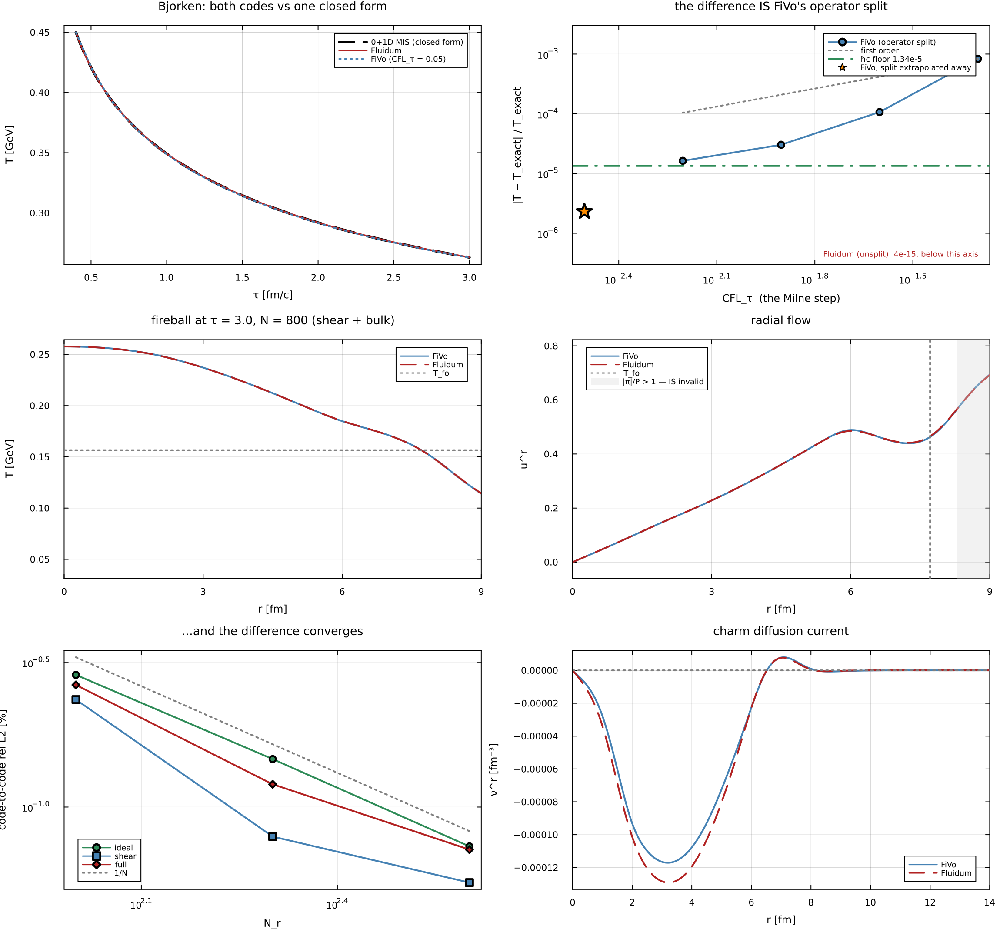
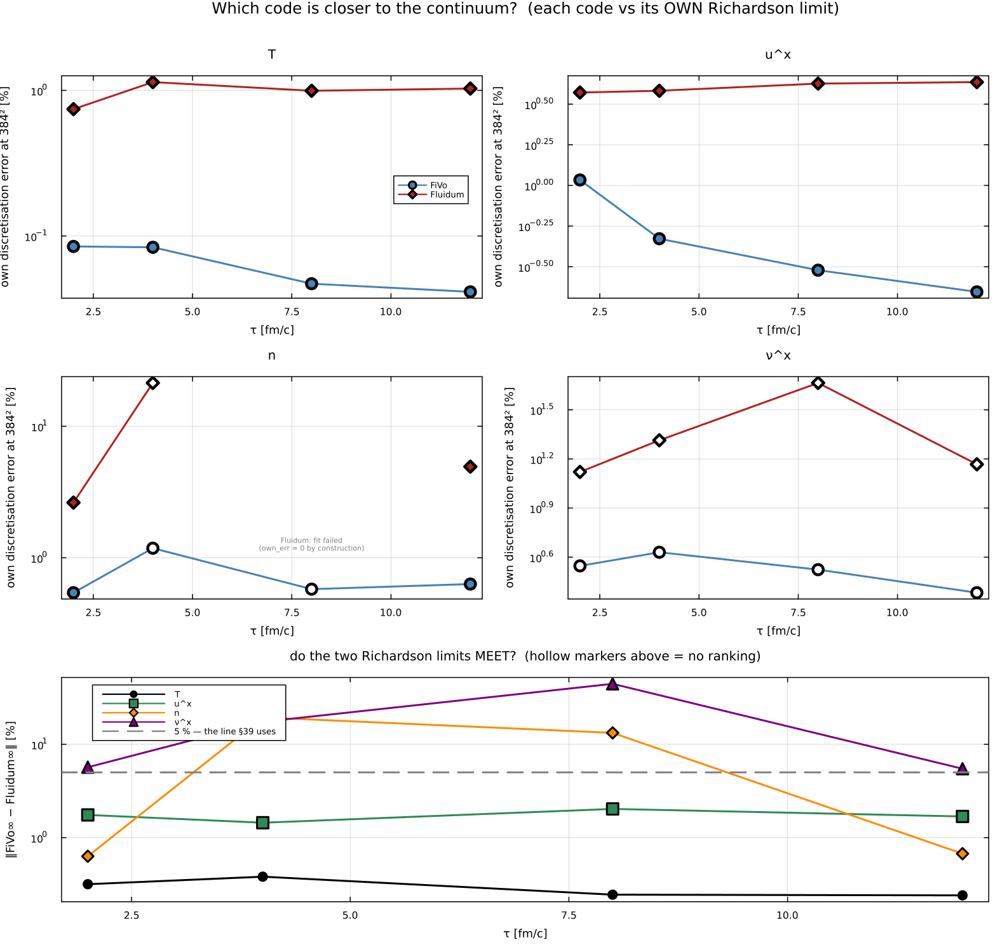
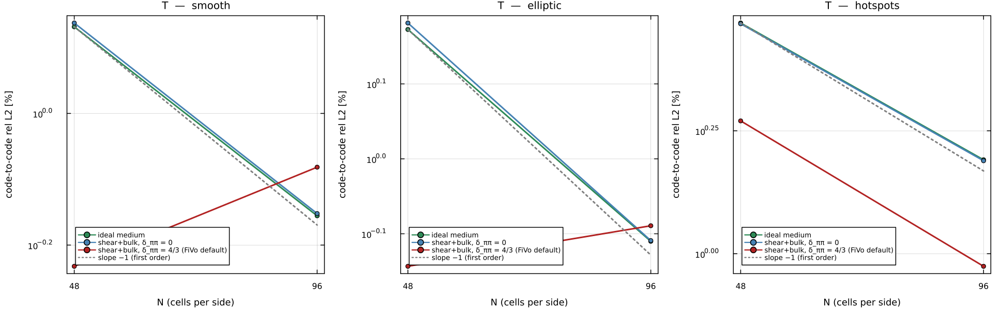

# FiVoHydro.jl — FiVo

[](https://github.com/RuwenSchulz/FiVoHydro.jl/actions/workflows/ci.yml)
[](LICENSE)
[](https://doi.org/10.5281/zenodo.22790954)

**A finite-volume solver for boost-invariant relativistic viscous hydrodynamics with a diffusing
heavy-quark (charm) charge**, written for heavy-quark transport in heavy-ion collisions.

Three solvers share one term interface, one set of analytic referees and one output format:

| solver | driver → module | evolves | geometry |
|---|---|---|---|
| **1+1D bulk** | `main.jl` → `hydro` | the medium $(T, u^r, \Pi, \pi_\phi, \pi_\eta)$ + a diffusing charge $(n, \nu^r)$ | radial Milne $(\tau, r)$ |
| **1+1D charm IS2** | `main2IS2.jl` → `hydro_current_IS2` | the charm $(\alpha, \nu^r, \pi_Q^r, \pi_Q^\perp, \Pi_Q)$ on a frozen background | radial Milne |
| **2+1D** | `main2D.jl` → `hydro2d` | medium + charge + the charm second moment | transverse Cartesian Milne $(\tau, x, y)$ |

**Two schemes, for two kinds of equation.** The bulk solvers (1+1D and 2+1D) evolve conservation
laws, so they are **conservative finite volume**: HLLE fluxes with MUSCL reconstruction (MC limiter)
in primitive variables, SSPRK2/3 in time, operator-split relaxation of the dissipative fields, and a
MOOD fallback. The charm IS2 solver evolves a fugacity and four relaxation equations, which have no
conservative form, so finite volume does not apply to them: it is written in the **quasi-linear
form** $A_t\,\partial_\tau U + A_x\,\partial_r U = S$ and advanced with RK4, with the characteristic
speeds taken from the eigenvalues of $A_t^{-1}A_x$. Its one genuinely conserved quantity, the charm
charge, *is* updated by a conservative face-flux difference inside that same solver.


<sub>One un-averaged MC-Glauber Pb+Pb event at N = 400, every sector on, run to τ = 8 fm/c, from
`examples2d/10_showcase.jl`. Reading across: the charm density with the Bjorken $1/\tau$ dilution
divided out, the same weighted toward the edge, then $|\omega|/|\sigma|$ — where the flow swirls
rather than shears — and the charm shear stress $|\pi_Q|$. The white line is freeze-out.
⚠ At $c_M = 0$ the charm second moment is **passive**: switching the vorticity coupling on moves
$\pi_Q$ and *nothing else*, so the claim is the bottom-right panel, not the fireball ones.</sub>

---

## Validation and error estimates

Every number below is printed by a script in this repository, and none is transcribed by hand —
re-run the command beside it and you get the number back. The two validation ladders were last run
on **2026-09-15**, the worked examples on 2026-09-14.

| | | |
|---|---|---|
| **1+1D validation ladder** | `test/run1d_gates.jl` | **10 / 10** |
| **2+1D validation ladder** | `test/run2d_gates.jl` | **22 / 22** |
| **unit + fast tier (CI)** | `Pkg.test()` | green |
| **worked examples** | `examples1d/`, `examples2d/` | **14 / 14** run clean |
| **cross-code, vs an independent code** | 5 algebraic gate files + a 15-gate 1+1D solve comparison | all pass (below) |

Every gate compares against a **referee that is not the code under test** — a closed form, a
semi-analytic ODE integrated to 1e-10, or a second, independently written solver.

### Measured errors

| what | against | measured |
|---|---|---|
| ideal Bjorken, 1+1D | $T\tau^{1/3}$ = const, and the $(e,n)$ ODE | convergence order **2.00** (SSPRK2) / **2.99** (SSPRK3); $T$ to 2e-9 |
| viscous Bjorken, 1+1D | the 0+1D DNMR ODEs, term by term | Richardson-extrapolated error ≤ **3e-4** |
| **viscous Gubser, 1+1D** | its semi-analytic ODE | $L_2(T)$ = **2.8e-5**, $L_2(\bar\pi)$ = **0.19 %** at $N_r$ = 800; order **2.12** in $T$ |
| charm diffusion mode | one closed $J_0/J_1$ ODE judging **all three solvers** | amplitude ≤ 3e-3, current ≤ 1 % |
| Bjorken, 2+1D | the 0+1D Israel–Stewart system | order **2.00** |
| Gubser, 2+1D | the exact solution | order **1.96** |
| sound attenuation, 2+1D | the **exact** MIS dispersion root | the excess damping is first order in $\Delta x$ — it is the scheme's own numerical viscosity, not a missing term |

The one number to read before quoting any other: **the dissipative fields are first order in
$\Delta\tau$**, because the relaxation is operator-split — halve `CFLτ` and their error halves. The
ideal sector is second order, and since the axis repair of 2026-09-15 (§8) so is $T$ on viscous
Gubser (order 2.12, with shear on), while $\bar\pi$ stays at 1.01. See "Known limitations".


<sub>`examples1d/03_analytic_benchmarks.jl` — the solvers against known results, as pictures rather
than assertions: ideal Bjorken at orders 2 and 3, viscous Bjorken against the DNMR ODEs, viscous
Gubser against its semi-analytic solution at three resolutions, and the charm diffusion mode through
both 1-D solvers against its closed ODE. In (c) and (c′) the first cell used to sit visibly off the
curve; the axis repair of 2026-09-15 (§8) removed it. The inset is still the honest convergence
test, taken at a **fixed** radius rather than at the axis cell, which is a *different physical
point* at every resolution.</sub>

---

## Cross-checks against a second, independent code

FiVo is checked row by row and solve by solve against **Fluidum.jl**, a hydrodynamics code with a
different discretisation (primitive-variable upwind on a quasi-linear matrix, adaptive Tsit5,
dissipation *inside* the matrix rather than operator-split) and different authors. Two codes agreeing
is not proof — but a gate that shows they discretise **the same PDE** to 1e-11, together with a
control that *fails*, is evidence neither code can produce alone.

| | measured |
|---|---|
| the two codes discretise the same PDE, every row of the 2+1D viscous system | **1e-11**, against a referee that is neither code |
| …and the control works | the other code's superseded matrix **fails the same test at 192 %** |
| charm second moment, 2+1D, on genuinely 2-D states | **2.2e-16**, all four switch combinations |
| transverse charm first moment, vs a closed form with real transverse structure supplied by neither code | FiVo converges to it: **1.05 → 0.53 → 0.43 %** at N = 32/48/64, worst single cell 0.8 % |
| **1+1D medium, Bjorken** | agreement to **2.3e-6** once FiVo's operator split is Richardson-extrapolated away — *below* the 1.3e-5 floor set by the two codes' differing $\hbar c$ constants |
| **1+1D medium, fireball** | the difference converges in every field and every sector: $T$ 0.33 → 0.16 % (ideal), 0.28 → 0.09 % (shear), 0.30 → 0.13 % (shear+bulk) over $N$ = 100 → 200 |
| **which code is closer to the continuum** (2+1D, real Pb+Pb event) | each code against its **own** Richardson limit at 384²: FiVo's own discretisation error is **8.7–25× smaller in $T$** and **3.4–19× smaller in $u^x$**, and there the two limits **meet** (0.24–0.38 % in $T$), which is what makes the ranking mean anything. ⚠ In the **charm** fields the limits are 13–44 % apart at τ = 4 and 8 and **no ranking may be read there** |



<sub>**1+1D.** Top left: both codes against one closed form. Top right: the whole FiVo–Fluidum
difference on Bjorken **is** FiVo's operator split — its *local* convergence order falls to 0.89 as
the Milne step is refined 8×, and extrapolating the split away (orange star) lands below the $\hbar c$
floor. Bottom: the fireball profiles, and the code-to-code difference converging like $1/N$ in all
three sectors. ⚠ The profile panels stop at **r = 9 fm because that is where hydrodynamics stops**:
$|\pi|/P$ crosses 1 at r = 8.29 fm (freeze-out is at 7.71) and reaches **2.9** by r = 13, where
Israel–Stewart — a gradient expansion needing $|\pi|/P \ll 1$ — has no content left. The dashed line
is freeze-out, the shaded band $|\pi|/P > 1$. Inside the valid region the two codes are
indistinguishable by eye.</sub>



<sub>**2+1D, a real Pb+Pb event.** Each code against its own Richardson limit at 384². ⚠ **Hollow
markers are points where the two Richardson limits do not meet — no ranking may be read off them**
(the charm fields at τ = 4 and 8, where a regulator that does not refine with the grid dominates).
The bottom panel is that test. A `fit failed` label means the order fit did not converge, so that
code's "error" there is zero *by construction*, not by accuracy.</sub>



<sub>**2+1D.** The code-to-code difference in $T$ against resolution, three initial conditions ×
three sectors. It is the *slope* that carries the claim, not the height — two codes sitting at a
fixed offset would be agreeing about a shared mistake. In the `ideal` and `mis` sectors the
difference falls at first order in every quantity. ⚠ **In `full` it stalls** (0.70–1.24× in $T$ and
$u^x$, while $n$ keeps converging at ~1.95×), and that is not a solver defect in either code: FiVo
carries the DNMR second-order coefficient $\delta_{\pi\pi} = \tfrac43 \tau_\pi$ and Fluidum's plain
Israel–Stewart has **no such coefficient at all**. Setting $\delta_{\pi\pi} = 0$ restores convergence
in exactly the quantities that had stalled — which is how a genuine missing term behaves and a
numerical accident does not.</sub>

⚠ The comparison lives in the private research repository this package is developed in; the figures
above are **copies**, with provenance and regeneration commands in
[`docs/figures/README.md`](docs/figures/README.md).

---

## Worked examples

Fourteen runnable examples — three 1+1D, eleven 2+1D — seconds to minutes each, each producing the
figure beside it. They are written to be **copied and edited**, and every trap this solver has
actually shipped is called out in a comment where it would bite.

| | |
|---|---|
| [`examples1d/`](examples1d/README.md) | the 1+1D library interface, the term switches, the analytic benchmarks |
| [`examples2d/`](examples2d/README.md) | eleven 2+1D examples: elliptic flow, resolution, fluctuating and real events, the dissipative sectors, the charm terms, vorticity, Gubser, and two showcases |

⚠ They need `Plots`, which is **not** a dependency of this package — it resolves through your default
environment, so a fresh clone must add it. Nothing in `src/`, `src2d/`, `test/` or `bench/` needs it.


<sub>`examples2d/02_elliptic_flow.jl` — ε₂ → momentum anisotropy, the reason to run 2+1D at all, run
sector by sector from **one** initial condition so the difference is the sector and not the IC, with
the ε₂ = 0 control that must return identically zero.</sub>

---

This package is a git submodule of a private research repository. Scripts `include` a driver and run
with `--project=Julia/FiVoHydro.jl`. `Julia/FiVo2DIdeal.jl` is an unrelated flat-Minkowski ideal code,
used only as a Riemann-problem benchmark. "2-D FiVo" means `main2D.jl` here.

> ⚠ **Paths beginning `Julia/Projects/…` or `Tex/…` are in that research repository, not in this
> one.** They are named throughout this document for provenance — so a number can be traced to the
> script that produced it — and are not links you can follow from a clone of this package. Everything
> needed to *run and check* FiVo is here: `src/`, `src2d/`, `test/`, `bench/`, `examples1d/`,
> `examples2d/`.

---

## Licence and citation

© 2026 Ruwen Schulz. Released under the **Apache License 2.0** — [`LICENSE`](LICENSE) for the terms,
[`NOTICE`](NOTICE) for the attribution notice to carry with redistributions. The code contains no
third-party source.

Copyright stays with the author; the licence grants use, it does not transfer ownership. Apache-2.0
lets you use, modify and redistribute the code, including commercially, on three conditions: keep
the licence and copyright notice, state what you changed, and accept that it comes with no trademark
rights and no warranty. It also carries an **express patent grant**, which MIT and BSD do not.

**If you use FiVo in work that is published, please cite it.** The licence does not require this;
it is the normal scientific courtesy, and [`CITATION.cff`](CITATION.cff) makes it one click — GitHub
renders a *"Cite this repository"* button from it, and it exports BibTeX and APA. Please also say
which version you ran (a commit hash is ideal): the validation numbers on this page are tied to a
commit, and the solver has had corrections that move results (§8).

Each release is archived on Zenodo and carries a DOI:

| | DOI |
|---|---|
| **cite this one** — always resolves to the newest version | [10.5281/zenodo.22790954](https://doi.org/10.5281/zenodo.22790954) |
| v0.1.0, this exact version | [10.5281/zenodo.22791452](https://doi.org/10.5281/zenodo.22791452) |

## 1. Which solver

| you want | use |
|---|---|
| a medium (with or without viscosity) and a diffusing charge, axisymmetric | 1+1D bulk: `build_model_1d` + `run_sim_1d!` |
| the charm current and second moment on a given medium (the production charm path) | 1+1D IS2: `run_static_IS2_test` |
| anything non-axisymmetric (ε₂, ε₃, single events), or the vorticity couplings | 2+1D: `build_model_2d` + `run_sim_2d!` |
| a production background exactly as the DPM makes it | `run_sim_ideal_diff_visc` (production calls, below) |

The first-order (`main2.jl`), BDNK (`main2BDNK.jl`, `mainBDNK*.jl`), MaxEnt (`main2M1.jl`, `main2M2.jl`) and
density-frame current solvers are separate closures of the same charm problem (Entry points, below).

---

## 2. Quickstart

### Install

```sh
git clone https://github.com/RuwenSchulz/FiVoHydro.jl.git
cd FiVoHydro.jl
julia --project=. -e 'using Pkg; Pkg.instantiate()'
julia --project=. -e 'using Pkg; Pkg.test()'      # the unit + fast tier
```

CI tests on **Julia 1.11**, and the checked-in `Manifest.toml` is resolved for 1.11.5; development here
also runs on 1.12. The solvers depend only on the packages in `Project.toml`. The **examples**
additionally need `Plots`, which resolves through your default environment
(`julia -e 'using Pkg; Pkg.add("Plots")'`).

⚠ On Julia 1.12, `instantiate` prints two warnings — the manifest was resolved with 1.11.5, and the
project hash is stale (a `DelimitedFiles` entry was added by hand rather than by a re-resolve, §8).
**Both are cosmetic**: all three drivers load and solve from a fresh clone on 1.12. `Pkg.resolve()`
silences them but rewrites the whole stdlib set to 1.12 and would break the 1.11 CI, so the manifest
is deliberately left as it is.

⚠ The snippets below are written as they are run inside the research repository this package is
developed in, so they say `Julia/FiVoHydro.jl/main.jl` and `--project=Julia/FiVoHydro.jl`. **From a
standalone clone, drop the prefix**: start with `julia -t auto --project=.` and `include("main.jl")`.
Nothing else changes.

### A first run

**1+1D medium + charge**, in a REPL started with `julia -t auto --project=Julia/FiVoHydro.jl`:

```julia
include("Julia/FiVoHydro.jl/main.jl"); using .hydro; const H = hydro
g = H.make_grid_1d(300; rmax = 15.0)
m = H.build_model_1d(; enable_shear = true, eta_over_s = 0.1,
                       enable_diff = true, kappa_coeff = 0.1163,     # D_s T
                       consistent_fm = true, terms = :default)       # §3
H.show_equations(m)                                                  # what m integrates, term by term
U = H.allocate_state(g, m)
H.initialize_from_radial!(U, g, m, 0.4, r -> 0.05 + 0.42exp(-r^2/20), r -> -4.0)
res = H.run_sim_1d!(U, g, m; τ0 = 0.4, τfinal = 5.0)                 # in memory
res.ok || error("step failed at τ = $(res.τ)")
f = H.fields_1d(g, U, m; τ = res.τ, work = res.work)                  # r, T, mu, alpha, n, e, P, ur, nur, Pi, piR, piPhi, piEta
H.save_fields("run.jld2", f; model = m)                               # §4
```

**1+1D charm on a frozen background.** Give either a JLD2 bundle or functions of (τ, r):

```julia
include("Julia/FiVoHydro.jl/main2IS2.jl"); using .hydro_current_IS2; const HI = hydro_current_IS2
bg  = HI.analytic_background(; T = (τ, r) -> 0.4*(0.6/τ)^(1/3)*exp(-r^2/30))     # or background_file = "bg.jld2"
res = HI.run_static_IS2_test(; background = bg, DsT = 0.1163, τ0 = 0.6, τfinal = 5.0, Nr = 300, rmax = 12.0,
                               consistent_fm = true, consistent_m2 = true, terms = HI.without(:acceleration))
res["n"], res["nur"], res["piQr"], res["PiQ"], res["terms"], res["diagnostics"]
HI.show_equations_IS2(; consistent_fm = true, consistent_m2 = true)
```

**2+1D:** `README2D.md` §1. It uses the same keywords (`build_model_2d(; enable_shear, eta_over_s, enable_diff,
kappa_coeff, consistent_fm, consistent_m2, terms)`) and the same defaults as `build_model_1d`.

Three things that bite. Each has cost a debugging session here.

1. `res.ok` means every step completed, **not** that the result is physical. Read `res.dQ`, `res.maxu` and the
   correction counters, and quote dissipative fields over cells with $T > T_{\rm fo}$ only: the dilute tail is
   shaped by floors and regulators.
2. `finalize_ic!` is not optional after `set_cell!`; the `initialize_*` helpers call it for you.
3. Julia soft scope: an accumulator updated in a *top-level* `for` is a new local each iteration. Put loops in
   functions (`CLAUDE.md`, trap 1).

---

## 3. Switching terms off — one interface for every solver

Every solver takes a `terms` keyword and accepts the same spellings (`src/terms.jl`):

```julia
terms = :default                               # the equations as they stand
terms = :homogeneous                           # a homogeneous medium at rest (see below)
terms = without(:vorticity, :acceleration)     # drop every term built from these ingredients
terms = (fm_inertial = false,)                 # one named term
terms = (preset = :full, without = (:acceleration,), fm_dlnh = false)
terms = (with = (:vorticity,),)                # the default plus both vorticity couplings
```

`show_terms()` prints the register. `show_equations(model)` (and `show_equations_IS2(; …)`) print the equations a
configuration integrates, with every term marked `[x]`, `[ ]`, or `≡0` if it vanishes in that geometry.

**Presets**

| preset | meaning |
|---|---|
| `:default` | every derived term on except the two vorticity couplings. Leaving those off is a decision, and it keeps every existing number and the parity with Fluidum |
| `:full` | every term on, vorticity included |
| `:homogeneous` | **the reduction to a homogeneous medium at rest**: every term built from a gradient or rate of the medium ($\nabla T$, $a = Du$, $\nabla u$, $DT$) is dropped. The inertial terms go with it. What survives is what the charm's own gradients drive: $\nabla\alpha$, $\nabla\nu$, $D\alpha$. This is the frame the shipped first moment was derived in, so with `consistent_fm = true` it reproduces `consistent_fm = false` **bit for bit** (gates T3, Gt7, X1). ⚠ θ includes the Bjorken $1/\tau$, so the longitudinal dilution goes too, as in the shipped row |
| `:none` | every term off: each field relaxes to zero on its own clock (a referee state) |

**Ingredients** (what `without` / `with` take). A term is dropped if it is built from any of them:

| ingredient | terms it removes |
|---|---|
| `:acceleration` (alias `:inertia`) | `fm_inertial` ($\tau_n n a$), `m2_accel_nu`, `m2_projector` |
| `:vorticity` | `m2_vorticity`, `shear_vorticity` |
| `:temperature_gradient` | `fm_gradT`, `m2_nu_gradTh` |
| `:shear` / `:expansion` | `m2_bg_gradu`, `m2_pi_sigma`, `m2_PiQ_sigma` / `fm_expansion`, `m2_bg_gradu`, `m2_expansion` |
| `:velocity_gradient` | all of ∇u: `fm_nu_gradu` and everything under `:shear`, `:expansion`, `:vorticity` |
| `:cooling` ($DT$), `:fugacity_rate` ($D\alpha$) | `fm_dlnh`, `m2_bg_DlnT`, `m2_expansion` / `m2_bg_Dalpha` |
| `:fugacity_gradient`, `:current_gradient` | `nu_gradalpha` (the shipped drive) / `m2_nu_gradient` |
| `:medium_gradients` | the `:homogeneous` set, relative to any base |

**The rules.**
- A term named explicitly in a disabled sector (for example `fm_inertial = false` without
  `consistent_fm`) is **refused**, and so is a misspelled name, because an attribution run must not silently
  measure nothing. A change that comes from a preset or an ingredient in a disabled sector is inert and is
  simply reset.
- Switched off, a term is removed **exactly**: the switched arithmetic is the shipped arithmetic minus that term
  (gates T2: 3e-15; Gt2/Gt3).
- In 1+1D the vorticity couplings and the second moment's Δ-projector vanish identically. Switching them is
  accepted and inert, and marked `≡0`.

**What the terms are worth** (`examples1d/02_terms.jl`, a viscous fireball, τ = 5 fm, fluid cells only). The
consistent first moment changes the charm current by 4.4× its shipped maximum. Removing the inertial term alone
moves it 9×, the ∇T channel alone 12×, and **both together only 0.6×**: on a near-ideal fluid Euler makes them
cancel as a pair (gate T4). Dropping one of them is therefore a much bigger change than dropping both. The 2+1D
numbers are in `examples2d/06_charm_terms.jl`.

---

## 4. Input and output

| input | how |
|---|---|
| grid | `make_grid_1d(Nr; rmax, nghost)`, `make_grid2d(Nx, Ny; xmax, ymax, nghost)` (also spelled `make_grid_2d`, so the 1-D/2-D names match) |
| model | `build_model_1d(; …)`, `build_model_2d(; …)` — keywords, the same names and defaults in both; IS2 takes keywords per solve |
| initial state | `initialize_uniform!`, `initialize_from_radial!(…, T(r), α(r); urof)`, or `set_cell!` + `finalize_ic!` per cell (1-D and 2-D); 2-D also `initialize_from_grid_csv!`; production CSVs through `run_sim_ideal_diff_visc(; init_csv)` |
| IS2 background | `background_file` (a JLD2 bundle with `r_grid`, `t_grid`, `T_spline`, `ur_spline`, optional α/n/ν/κ/τ_diff/gradient splines) **or** `background = analytic_background(T = (τ, r) -> …, ur = …)` — any functions of (τ, r) |

| output | what |
|---|---|
| `fields_1d(g, U, m; τ, work)` | NamedTuple of vectors over the interior: `r, T, mu, alpha, n, e, P, ur, utau, v, nur, Pi, piR, piPhi, piEta, ok, τ` — physical units (GeV, fm) |
| `fields_2d(g, U, work, m)` | NamedTuple of Nx×Ny matrices: `x, y, T, mu, alpha, n, e, P, ux, uy` + every dissipative field of the layout. ⚠ the signature is not the 1-D one: `work` is POSITIONAL and there is no `τ` (the primitives come from `work`, which already knows it) |
| `run_static_IS2_test` | Dict: `r_grid, t_grid, n, nur, alpha, piQr, piQperp, PiQ` (Nr × Nt), `diagnostics` (per solve), `terms`, `consistent_fm`, `consistent_m2` |
| `save_fields(path, f; model, meta)` / `load_fields(path)` | **all three solvers** — one JLD2 file with the fields **and** what produced them: the resolved term switches, the `show_equations` printout, every model knob, the git revision (`-dirty` if uncommitted), a time stamp. Plain types only, so it reads without FiVo loaded. Schema: `src/fields_io.jl` |
| `run_sim_ideal_diff_visc` | legacy: `snapshot_tau_*.csv` per dump (+ `_meta.csv`); with `postprocess = true` also a `hydro_currents_*.jld2` and a spline bundle ⚠ written to the shared `Julia/Plot/splines/FiVo.jld2` |

---

## 5. Validation

```sh
julia --project=Julia/FiVoHydro.jl -e 'using Pkg; Pkg.test()'                             # ~4 min, IN CI: unit + the 1-D fast tier (T, A4, IO)
julia -t auto --project=Julia/FiVoHydro.jl Julia/FiVoHydro.jl/test/run1d_gates.jl         # 1+1D ladder, ~10 min
julia -t auto --project=Julia/FiVoHydro.jl Julia/FiVoHydro.jl/test/run2d_gates.jl         # 2+1D ladder, ~30 min
FIVO1D_TIER=fast … run1d_gates.jl;  FIVO2D_TIER=fast … run2d_gates.jl                      # the CI tiers, ~70 s / ~60 s
FIVOHYDRO_LONG_TESTS=1 julia … Pkg.test()                                                  # + A1/A2, X1, the IS2 stability run
```

Every gate compares against a **referee that is not the code under test**: a closed form, a semi-analytic ODE
integrated to 1e-10 (`test/analytic_referees.jl`), or another solver. Each runner exits 1 on any failure, and a
listed gate whose file has gone missing counts as a failure.

**1+1D** (`test/run1d_gates.jl`, built 2026-09-11; 10 gates, **10/10 on 2026-09-14**):

| gate | checks against | measured |
|---|---|---|
| **T** term switches | the switched pieces vs the shipped expressions; `:homogeneous` ≡ shipped on a solve (bulk, IS2); Euler cancellation of ∇T + inertia on an ideal fluid; refusals | pieces 3e-15; bit for bit; pair cancels to 0.5 % of either term alone |
| **A1** ideal Bjorken | $T\tau^{1/3}$ = const (conformal); the (e, n) ODE with a charge (LatticeHRGEOS) | order 2.00 (SSPRK2) / 2.99 (SSPRK3); T to 2e-9, nτ to 4e-16 |
| **A2** viscous Bjorken | the 0+1D DNMR ODEs, each of δ_ππ, τ_ππ, λ_πΠ, δ_ΠΠ, λ_Ππ; wrong-sign referees must miss | first order (the split); extrapolated error ≤ 3e-4 |
| **A4** viscous Gubser | the semi-analytic ODE (as 2-D G1v) | L2(T) 2.8e-5, L2(π̄) 0.19 % at Nr = 800, order 2.1 / 1.0 (§8, the axis repair) |
| **X1** diffusion mode | $\delta n = AJ_0(kr)$, $\nu^r = BJ_1(kr)$ closed ODE, **1D bulk, IS2 and 2D** on one referee, four term configurations | A to ≤ 3e-3 (1D, IS2), B to ≤ 1 %; 2D converges with dx |
| **IO** the output format | `save_fields` → `load_fields` for all three solvers: fields bit for bit, the terms and knobs that made them, and the "plain types" promise re-checked in a process that loads only JLD2 | 21/21, 12 s |
| IS2 drive, IS2 speeds, density frame, BDNK, M1 | as before (also in `Pkg.test()`) | — |

**2+1D:** 22 gates (21 + Gd, the medium DNMR couplings; Gt now includes Gt7/Gt8), **22/22 on 2026-09-15** (≈29 min), listed in `README2D.md` §5 — which also prints **what each gate measured**, gate by gate. Cross-code gates against Fluidum live in
`Julia/Projects/FiVoFluidumComparison/` (three of them in `programme.jl check`).

`Julia/Projects/FiVoBenchmark/` (`run_all_benchmarks.jl`, about 5 min, writes `BENCHMARK_REPORT.md`) is the older
benchmark suite. It runs the scheme through its own harness (`bench_common.jl`) and is wired into no gate. Two of
its checks were repaired on 2026-09-11. The viscous Bjorken check had passed at 5% while the heating was 4× too
small, and is now a gate on the heating itself. The viscous Gubser run used an acausal C_s = 1, which the ∂_τu^r
fix exposed (§8), and now uses 0.2. Re-run at HEAD on 2026-09-14: **48 PASS / 1 CHECK** (a documented historical note) **/ 0 FAIL**, with every
PASS line and every allocation figure identical to the 2026-09-11 report — only the wall times moved (a busier
machine). The ladders above are the validation of record.

---

## 6. Cost

`bench/bench1d.jl` (1+1D) and `bench/bench2d.jl` (2+1D, `README2D.md` §6) report ns per cell-step, best of three
after a warm-up. They live in `bench/` so that `run_suite.jl` discovers them by prefix — until 2026-09-14 they sat
at the package root, where the suite could not see them and nothing ran them. Measured 2026-09-11, 8 threads, on the production-like Pb+Pb profile, τ 0.4 → 2 fm:

| 1+1D bulk | Nr = 400 | Nr = 800 |
|---|---|---|
| ideal | 2.9 µs (144 steps, 0.17 s) | 2.7 µs (288 steps, 0.61 s) |
| + shear / + bulk | +41 % / +36 % | +45 % / +45 % |
| + diffusion | +47 % — and 1.5–2.2× the steps (the diffusion step cap) | +47 % |
| all sectors + diffusion | 4.5 µs (223 steps, 0.40 s) | 4.0 µs (640 steps, 2.1 s) |
| + `consistent_fm` | −2 % (noise) | +6 % |

| charm IS2 (analytic background, τ 0.6 → 1.6) | Nr = 300 | Nr = 600 |
|---|---|---|
| shipped closure | 48 µs, 18 MB allocated per step | 50 µs, 36 MB per step |
| `consistent_fm` | +25 % | +21 % |
| `consistent_fm + consistent_m2` | +40 % | +33 % |

**Re-measured 2026-09-14 at 4 threads** (what `run_suite.jl bench` records, 223 s): the per-cell-step costs roughly
double against the 8-thread table above — ideal 6.6 µs at Nr = 400 and 6.4 µs at Nr = 800, all sectors + diffusion
10.7 / 8.3 µs, charm IS2 76 µs at Nr = 300 — while the **allocation is thread-independent and reproduces exactly**
(17.9 MB/step at Nr = 300, 35.9 at Nr = 600). Quote the thread count with any of these numbers.

A whole 1+1D bulk solve is seconds; the Pb+Pb production background (Nr = 800 to τ = 6 fm, 4 threads) took
184 s. **The IS2 solver is ~15× the bulk solver per cell** and allocates ~60 kB per cell per step: every cell
builds three 5×5 systems per RK stage (centre and two faces), each with an `lu`, two solves and an `eigvals`.
The obvious lever, not taken: rows 3–5 of that system are trivialised (the second moments are evolved by
`_second_moment_eigen_rhs!`), so `B = At⁻¹Ax` is block upper-triangular and its spectrum is that of its 2×2
(α, ν) block plus zeros — a closed form instead of a 5×5 `eigvals`. It would move results at round-off (the CFL
step and the Rusanov dissipation read the speed), so it was left for a deliberate, gated change.

---

## 7. Known limitations — read before quoting a number

| | |
|---|---|
| **1-D bulk products before 2026-09-11 used a ∂_τu^r ~4 % of its value** | every viscous 1-D FiVo background (Pb+Pb, O+O) was made with it. On the Pb+Pb production IC the fix moves u^r by +1–1.6 % in the bulk, Π by 5–9 %, π^η_η by 1–17 % (τ = 4 fm, T > T_fo). `hydro.HYDRO_LEGACY_DTAU_UR[] = true` reproduces the old arithmetic. Nothing has been re-minted |
| **on a fine radial grid the corrected ∂_τu^r rings** | at full strength it makes the operator-split NS target short-wavelength unstable, and **refining `dr` makes it worse** while a 5× smaller Δτ changes nothing — it is a scheme instability, not a discretisation error. Measured on the O+O bulk: stable at dr = 0.026 fm, ringing at dr = 0.013 fm (|d²T| growing 6.9e-5 → 2.6e-4 over τ ∈ [3.4, 4.7]). **The onset is measured, not derived** — a new grid must measure its own; `diag.dtau_ur_q_max` says whether ∂_τu^r is grid-scale at all. Cure: `dtau_u_smooth_len` (fm, default 0 = off = bit-identical to every result before 2026-09-13) band-limits it at a fixed **physical** length. O+O production uses 0.10 fm (`OO_BG_DTAUUSMOOTH`); the Pb+Pb bulk (dr = 0.025 fm) sits just on the stable side and **has not been checked**. Fluidum does not have this — it keeps the ∂_τu^r coefficient inside `A_t` and is grid-converged to dr = 0.0043 fm (`EQUATIONS1D.md` §8) |
| first order in time once anything dissipative is on | the operator split (1-D and 2-D); halve `CFLτ` to check. The IS2 solver is unsplit RK4 |
| the 1-D cold-start recovery with `ConformalHQEOS` fails at α ≲ −20 | its initial guess $T_0 = E^{1/4}$ ignores $a_{SB}\hbar c^{-3}$, and the φ direction is too badly scaled when $n \sim e^{-24}$. `LatticeHRGEOS` converges at every α tried; production is unaffected. Use a charge-free EOS (`ConformalHQEOS(m_hq = 0, g_hq = 0)`) for charge-free tests |
| **the shear sector is acausal for C_s = `tauShear_coeff` > 1/2** | conformal IS needs η/(τ_π(e+P)) = C_s ≤ 1/2, and an acausal IS theory is unstable in a moving frame. With the ∂_τu^r fix the 1-D solver shows it: viscous Gubser runs at C_s ≤ 0.6 and runs away at 0.8 (growing with resolution). The builders warn. ⚠ `run_sim_ideal_diff_visc` still defaults to C_s = 1 (production passes 0.2) |
| the axis cell | **repaired 2026-09-15** (§8). It still carries an O(dr) mismatch between the solver's acceleration and $\nabla T$ (gate T4: halves with each refinement), but the first cell is no longer special-cased: $L_2(T)$ on viscous Gubser at $N_r$ = 800 is **2.78e-05** (was 2.61e-04) and the order in $T$ is **2.12** (was 1.77). `FIVO_AXIS_CELL_EXACT=0` restores the old arithmetic bit for bit |
| the dilute edge | **Israel–Stewart stops being valid before the grid does.** On a Woods–Saxon fireball (τ 0.4 → 3, shear+bulk) $|\pi|/P$ crosses **1 at r = 8.29 fm** — freeze-out is at 7.71 — and reaches **2.9 by r = 13**, where the shear stress is three times the pressure and the gradient expansion carries no content. Any structure out there is the *model* failing, not the solver: the second difference of $u^r$ *grows* with refinement (1.5e-3 → 2.2e-3 → 9.1e-3 at $N_r$ = 400/800/1200) while above $T_{\rm fo}$ it falls (6.6e-4 → 1.8e-4 → 8.5e-5). ⛔ **No numerical knob removes it**, and six were measured and rejected: the timestep (non-monotonic, resolution-dependent optimum, wrong choice gives $\max|u^r|$ = 4.1), filters (up to **17× worse** — they damp the dissipative fields, and it is viscosity that suppresses the front), `dtau_u_smooth_len` (saturates at 6.5e-4), the box size (identical to **six digits** at rmax = 20/30/40 fm), the near-vacuum floor (ten orders away), and axis-face reconstruction. 🔑 **Quote from $T > T_{\rm fo}$, and plot to the validity edge** — floors and the vacuum ramp shape the tail below it |
| the vorticity couplings are off by default | they vanish in 1+1D; in 2+1D see `README2D.md` §7 |
| no thermal fluctuations, no $c_M$ back-coupling in 2+1D | not implemented |

---

## 8. Corrections of 2026-09-11, 09-13 and 09-14

Found while building the 1+1D ladder. Each one is at its code and in `EQUATIONS1D.md` §8:
- **∂_τu^r in the 1-D relaxation (production path).** It came out at ~4% of its value. Against viscous Gubser
  L2(π̄) is 132% with the old history and 1.5% with the fix.
- **SSPRK3 was first order.** Its last stage ran at τ+Δ instead of τ+Δ/2.
- **π was zeroed on every other step for charge-free fluids at rest.** The recovery bisection was capped 15
  iterations short of float resolution.
- **The dormant DNMR couplings.** λ_πΠ and λ_Ππ had the wrong sign and τ_ππ lacked its trace (no caller used
  them).
- **IS2 diagnostic counters** accumulated across solves.
- **FiVoBenchmark's viscous Gubser ran an acausal shear sector** (C_s = 1). It completed only because of the
  ∂_τu^r defect. With the fix it crashes, as acausal IS must; the bench now uses C_s = 0.2.

**2026-09-13.** The 09-11 ∂_τu^r fix is right and the closed-form gates agree with it, but at full strength it
makes the split NS target short-wavelength unstable and the O+O bulk ran into it (§7). `dtau_u_smooth_len`
band-limits the term at a fixed physical length; default 0.0 reproduces everything before that date bit for bit.
The full measurement, the linear estimate that does **not** give a usable threshold, and why Fluidum is immune:
`EQUATIONS1D.md` §8.

**2026-09-14 — `main2D.jl` had an UNDECLARED DEPENDENCY, and no test could see it.** `main2D.jl:27` does
`using DelimitedFiles` (for `readdlm` in `initialize_from_grid_csv!`), and `DelimitedFiles` was in neither
`Project.toml` nor `Manifest.toml`. Interactively it resolves from the default environment, so nothing ever
failed — but `Pkg.test()` runs in a sandbox that does not include it, so **the 2+1D solver could not be loaded
in the package's own declared environment.** `Pkg.test()` never noticed because until today no test loaded
`main2D.jl`; the new IO gate does, and failed on its first run under `Pkg.test()`. Now declared. ⚠ `Plots` is
the same class of problem and is still undeclared — the examples need it and nothing in `src/`, `src2d/` or
`test/` does, so it is called out in the example READMEs instead of added as a dependency of the solver.
⚠ `Manifest.toml` still records `julia_version = 1.11.5` (what CI pins) while this machine runs 1.12.6, so the
`DelimitedFiles` entry was added by hand rather than by a re-resolve; `Pkg` warns that the project hash is
stale. `instantiate` and `test` both pass with the warning.

**2026-09-15 — THE FIRST CELL WAS TREATED AS IF IT WERE ON THE AXIS, and it is not.** The first
physical cell sits at $r = \Delta r/2$. Three places acted as though it sat at $r = 0$:
`apply_bc!` zeroed its conserved radial momentum $S_r$, `rhs!` zeroed its $u^r$, and
`reconstruct_muscl_prims!` left its face first order. On Gubser $u^r(\Delta r/2) = \Delta r/2$
exactly — an **O(Δr) quantity being discarded every step**, which is precisely the first-order error
the cell used to show. The zeroing entered in an early debugging commit and was documented nowhere.

Measured on viscous Gubser (η/s = 0.02, τ = 1 → 2), against the exact time derivative at τ₀ the
solver's RHS in cell 1 was **−18.7 %** and did not improve with resolution; it is now **+4.5e-5**,
the same as the interior. Consequences on the gate:

| | before | after |
|---|---|---|
| $L_2(T)$, $N_r$ = 800 | 2.614e-04 | **2.780e-05** (9.4×) |
| $L_2(\bar\pi)$, $N_r$ = 800 | 1.500e-02 | **1.924e-03** (7.8×) |
| observed order in $T$ | 1.77 | **2.12** |
| cell-1 $\bar\pi$ error at $N_r$ = 400 | 1.56e-03 | **3.96e-06** (394×) |

⚠ **The three act together.** Turning the reconstruction on alone makes cell 1 *worse* (−18.7 % →
−38 %), which is why an earlier attempt at exactly that was measured and rejected.
✅ Well-balancedness is preserved **exactly**: a uniform static fluid still gives $\max|u^r| = 0$ to
machine zero at every resolution. The 1-D ladder is **10/10** with the repair, T4 (the axis Euler
cancellation) and X1 (the diffusion mode through all three solvers) included. The 2+1D solver is
untouched — it is transverse Cartesian and has no axis (`src2d/rhs2d.jl`: "no special
first-physical-cell treatment").
⚠ **This moves 1-D results.** On a Woods–Saxon fireball the change is small (the profile is flat at
the axis: self-convergence 9.74e-4 → 9.41e-4 at $N_r$ = 200), but anything with structure near
$r = 0$ moves. `FIVO_AXIS_CELL_EXACT=0` reproduces every pre-2026-09-15 number bit for bit.

**2026-09-14.** `bench/benchmark.jl`, `bench/gubser_validation.jl` and `bench/ic_diagnostics.jl` had been unable to
construct a model since `do_axis_project_nur` was added: they passed 35 positional fields where the back-compatible
constructors cover 36/37/39. The missing argument was restored in all three. They are the legacy CLI workflows at the
end of this file; the validation of record is still the two ladders (§5).

---

# Reference

## How the solvers share code

`main2D.jl` includes six files from `src/`: `constants.jl`, `utils.jl`, `eos.jl`, `terms.jl`, `primitives.jl`
(transport-coefficient models) and `relaxation_laws.jl`. Everything that knows about dimensionality (grid,
primitive recovery, fluxes, reconstruction, RHS, timestepper, dissipation, floors, boundaries) is
**re-implemented** in `src2d/`. That is deliberate, and the reason is `main2D.jl`'s header: the 1-D production
path stays bit-identical when the 2-D solver changes. Gates police the overlap instead of shared source:
`test_primrec2d_vs_1d.jl`, `test_reproduction2d.jl` and `test_dissipative_vs_1d.jl` (2-D vs the 1-D production
solver), `test_consistent_fm2d.jl` Gc1 and `test_consistent_m22d.jl` Gm1 (the 2-D closures in their 1-D limit, to
round-off), and X1 (one referee judging all three solvers).

What IS shared: the term register (`src/terms.jl`, since 2026-09-11) and the closure formulas the 1-D bulk and
IS2 solvers both call (`src/hq_consistent_firstmoment.jl`). The 2-D solver reads **no ENV variables** (keywords
only); the 1-D drivers read many (Environment flags, below).

## Entry points

| file | module | physics | primary consumer |
|---|---|---|---|
| `main.jl` | `hydro` | **bulk** fluid + charge: `run_sim_ideal_diff_visc(; kwargs…)` (library) / `main()` (CLI, ENV-driven). Includes all of `src/`. | DPM `bulk_background{solver=fivo}`, `bulk_background_oo` via `Projects/LangevinPaper{1,OO}/generate_physical_background_fivo.jl`; FiVoBenchmark |
| `main2IS2.jl` | `hydro_current_IS2` | **charm current, Israel–Stewart 5-field** `(α, ν^r, π_Q^{rr}, π_Q^⊥, Π_Q)` on a frozen bulk: `run_static_IS2_test(; background_file, …)`. Most-consumed entry (≈56 call sites). | DPM `charm_hydro_oo`; `Projects/LangevinPaper{1,OO}/is2_dropin.jl`; CMExperiment |
| `main2.jl` | `hydro_current` | charm current, first-order (ν^r relaxes to NS): `solve_current_only` | AttractorPaper1/5, AttractorFoundations |
| `main2M1.jl` | `hydro_current_M1` | charm current as a 3-field **maximum-entropy (M1)** moment system, no transport coefficients, no regulators: `run_static_M1_test`, `solve_M1` | `Projects/LangevinPaper1/m1_dropin.jl`, `Tex/HeavyQuarkHydro/diag_m1_*` |
| `main2M2.jl` | `hydro_current_M2` | four-field MaxEnt **M2** system (parallel to M1): `run_static_M2_test` | `m2_dropin.jl`, `Tex/HeavyQuarkHydro/plot_m2_*` |
| `main2BDNK.jl` | `hydro_current_bdnk` | BDNK current-only (keeps `∂_τ α`, `σ_T/σ_a`); has an `EPS_NU=density_frame` branch | CrossSolverComparison, `Tex/ModePaper1` |
| `mainBDNK.jl` / `mainBDNK_causal.jl` | — / `bdnk_causal` | BDNK bulk driver `run_sim_bdnk`; the genuinely causal telegraph variant | FiVoBenchmark `bench_bdnk_*` |
| `mainDensityFrame.jl` | — | thin driver: `charge_mode=:density_frame` (ν-less parabolic flux) then `hydro.main()` | DensityFrame project |
| ~~`mainJonly.jl`, `mainJonly2nd.jl`~~ | — | **no longer exist** (renamed 2026-04: `main2.jl`, and `main2IS2.jl` descends from `mainJonly2nd.jl`). `MainFiVo/Code/case_specs.jl:87`, `run_full_pipeline.jl`, `plot_fivo_modes.jl` and `Julia/tools/diag_piQ_*` still point at them | dead |
| `mainBGonly.jl` | `hydro_bgonly` | background-only copy of `main.jl` (≈900 duplicated lines) — kept: it is MainFiVo's `:background_only` pipeline mode (`Code/case_specs.jl:81`) | MainFiVo |
| **`main2D.jl`** | **`hydro2d`** | **the 2+1D solver** (transverse Cartesian, boost-invariant Milne): bulk + charge `(T, u^x, u^y, Π, π^{xx}, π^{xy}, π^{yy}, π^{ηη}, n, ν^x, ν^y)` via `run_sim_2d!`. Includes all of `src2d/`. Charge sector carries the consistent first moment (`consistent_fm`) and a passive consistent second moment (`consistent_m2`). See `README2D.md`. | `Projects/FiVoFluidumComparison`; `tools/export_background2d.jl`; the 22-gate ladder `test/run2d_gates.jl` |
| `src/FiVoHydro.jl` | `FiVoHydro` | package wrapper: includes `main.jl`, exports `hydro` (only `Projects/SoftPionPaper` uses `import FiVoHydro`) | — |

Shared by the drivers (2026-09-11): `src/terms.jl` (the term register, §3), `src/api1d.jl` (the 1+1D
library interface, included by `main.jl`), `src/fields_io.jl` (`save_fields` / `load_fields`, §4).

`src/` (32 files, incl. the `FiVoHydro.jl` package shim) is the bulk solver: `eos.jl` (ConformalHQEOS, LatticeHRGEOS, TabulatedHQEOS),
`primitives.jl` (`IdealDiffViscModel`, viscosity models), `primrec.jl` (3-unknown Newton recovery),
`fluxes.jl`/`reconstruction.jl`/`rhs.jl`/`timestepper.jl` (the FV scheme), `dissipation.jl` (transport
coefficients, `relax_dissipative!`, all stabilizers), `mood.jl`, `floors.jl`, `io.jl`, `gubser.jl`
(analytic Gubser + `initialize_gubser!`), `is2_second_moment_builder.jl` (IS2 matrices),
`runtime_flags.jl` (the single `HYDRO_*` ENV reader). `relaxation_laws.jl` is a *reference*
exact-exponential integrator used by tests/benches, not a solver hook.

## Production calls

The production drivers, as the DPM recipes call them. For new work use the library interface (§2);
these keep their legacy defaults because ten callers rely on them. Bulk solve (from
`generate_physical_background_fivo.jl`):

```julia
include("Julia/FiVoHydro.jl/main.jl"); using .hydro
hydro.run_sim_ideal_diff_visc(
    outdir="scratch/run1", Nr=800, rmax=20.0, τ0=0.4, τfinal=13.0, dump_dt=0.1,
    init_csv="data/fivo_bulk_ic_pbpb.csv",             # columns r,T,ur,(alpha|n),...
    eos=hydro.LatticeHRGEOS(),
    enable_diff=true,  DsT=0.1163,                      # D_s·T [GeV·fm]; κ = DsT·n/(T·fmGeV)
    enable_shear=true, eta_over_s=0.1, tauShear_coeff=0.2,
    enable_bulk=true,  zeta_over_s=0.1, tauPi_coeff=15.0,
    deltaShear_factor=4/3, taupi_pi_factor=0.0,         # δ_ππ damping that matches Fluidum MIS (2026-07-02)
    CFL=0.15, time_integrator=:ssprk2)
```
Output: `snapshot_tau_*.csv` (+ `_meta.csv`) per dump in `outdir`; with `postprocess=true` also a
Langevin-style `hydro_currents_*.jld2` and spline bundle.

Charm IS2 on a frozen background (`background_file` is a JLD2 with `r_grid`, `t_grid`, `T_spline`,
`ur_spline` and optionally `alpha`/`nur`/`kappa`/`tau_diff` splines — see `load_IS2_background`):

```julia
include("Julia/FiVoHydro.jl/main2IS2.jl"); using .hydro_current_IS2
res = hydro_current_IS2.run_static_IS2_test(; background_file="bg.jld2", DsT=0.1163,
          τ0=0.4, τfinal=8.0, Nr=1000, rmax=25.0, CFL=0.15, CFLτ=0.03, dump_dt=0.1,
          use_cM=false, eos=hydro_current_IS2.LatticeHRGEOS(canon_factor=1.0))
res["r_grid"], res["t_grid"], res["n"], res["nur"], res["alpha"], res["piQr"], res["piQperp"], res["PiQ"]
res["diagnostics"]   # steps, linear/eigen failures, nu_bound_hits, cone_projections, jtau_nonpositive
```
Every IS2 regulator is an ENV-overridable `const` read at module load (table below); production sets
them in the DPM recipe (`Projects/LangevinPaper1/dpm_recipes.jl`, `charm_hydro_oo`).

Tests, the validation ladders and the benchmarks: §5 above.

## Stabilizers (bulk solver) — all OFF by default

The shipped defaults exercise the bare scheme; FiVoBenchmark's D1 audit shows the validated
observables are stabilizer-independent. Production bulk runs enable only what the DPM recipe passes.

| kwarg (`run_sim_ideal_diff_visc`) | default | what it does | where |
|---|---|---|---|
| `nur_clip_factor` | `-1` (off) | clip `\|ν^r\| ≤ f·n_smoothed·u^τ` after relaxation | `src/dissipation.jl` `relax_dissipative!` (end) |
| `alpha_filter_eps`, `nur_filter_eps`, `visc_filter_eps` | `0` | Kreiss–Oliger filter strength, clamped to `[0, 0.24]` | `smooth_alpha!` etc. |
| `alpha_smooth_len`, `nur_smooth_len`, `visc_smooth_len` | `0` | smoothing length → ε via `eps_from_len(·, dr)` | same |
| `dtau_u_smooth_len` | `0` (off) | band-limit `∂_τu^r` at a fixed **physical** length (fm) before it feeds `θ_full`, the NS targets and the charge projector. NOT cosmetic: the split scheme loses its `k²` viscous damping at short wavelength and rings, and the ringing **grows with resolution** — onset is measured, not derived (between dr = 0.026 and 0.013 fm on the O+O bulk); see the 2026-09-13 entry in `EQUATIONS1D.md`. Off is the pre-09-13 behaviour; `diag.dtau_ur_q_max` says whether a run is in the band | `src/dissipation.jl` `bandlimit_centered!` |
| `do_soft_project_nur` | `false` | tanh projection of ν_NS and ν_new into `\|ν^r\| < n u^τ` | `_soft_project_nur_phys` |
| `do_axis_project_nur`, `axis_project_nfit` | `false`, `2` | polynomial axis projection of ν^r | `axis_project_nur_tapered!` |
| `Pi_clip_factor`, `pi_clip_factor` | `-1` (off) | clip bulk/shear relative to the pressure | `relax_dissipative!` |

Production operating points: Pb+Pb bulk (`bulk_background{solver=fivo}`): Nr=800, rmax=20, CFL=0.15,
`deltaShear_factor=4/3`, clips/filters off. O+O bulk (`bulk_background_oo`): nr=500, rmax=6.5,
rdrop=5.0, cfl=0.1, `nurclip=0.3`, diffdt=0.01. The CLI `main()` falls back to
`last_ic_diagnostics.env` (NUR_CLIP_FACTOR=0.98, ALPHA_FILTER_EPS=0.01, VISC_FILTER_EPS=0.01,
PI/SHEAR_CLIP_FACTOR=0.35, TAU_SHEAR_COEFF=0.2, TAU_PI_COEFF=15) when an ENV var is unset — a
different operating point from the kwarg defaults.

## Charm-sector regulators (IS2) — what is on in production

| knob (ENV) | default | production | meaning |
|---|---|---|---|
| `FIVO_VACUUM_N_LO` / `FIVO_VACUUM_N_HI` | `1e-6` / **`2e-3`** (was 1e-2 before 2026-07-26) | Pb+Pb: default | density-gated ramp `w=(n−n_lo)/(n_hi−n_lo)` multiplying the WHOLE RHS ⇒ effective `τ_n/w` in the dilute tail. Calibrated on Pb+Pb (~24 charm quarks). |
| `FIVO_VACUUM_N_REL_HI` / `_LO` | `0` (off) / `1e-4` | O+O: `0.003` | the same ramp relative to the slice maximum — needed on O+O (0.27 charm quarks) where the absolute ramp is wrong in both directions |
| `FIVO_VACUUM_T_HI` / `_LO` | `0` (off) | off | T-gated ramp — **documented negative result**, leaves the warm flat tail undamped |
| `FIVO_IS2_ALPHA_MIN` / `_MAX` / `_SOFT` | `-20` / `200` / `1` | default | softplus floor on α (the old ±200 was an overflow guard mistaken for a bound; 2026-08-03) |
| `FIVO_IS2_NU_BOUND`, `_FRAME`, `_SMOOTH`, `_KNEE` | `0` (off), `"lab"`, `0`, `0.8` | O+O: `0.7` | soft saturation `\|ν^r\| ≤ f·n`. ⚠ `"lab"` is tighter than the physical LRF bound by `u^τ` (≈1.37 on Σ_fo); `"lrf"` is the physical frame. |
| `FIVO_IS2_CONE_PROJECT` | `0` (off) | O+O c_M variant: `0.995` | projection into the admissible cone |
| `FIVO_IS2_JTAU_FLOOR` | `0` | default | floor on J^τ |
| `FIVO_NU_RAPIDITY` | `0` | off | rapidity chart — **do not promote as is** (undone by the α recovery one line later) |
| `FIVO_CM_SIGN` | **`+1`** | default | `-1` was the elliptic (ill-posed) branch — a real bug until 2026-07 |
| `FIVO_IS2_TAUN_DEGENERACY`, `_TAUM_DEGENERACY` | `0` (bare) | bare | τ_n = D_s·z·K₃/K₂ with NO `÷g_hq` (2026-07-16/21); τ_M = τ_n/2 |
| `FIVO_IS2_CAUSAL_COEFF` | `1` (on) | on | `τ_n ← max(τ_n, κ/χ)` keeps the diffusion signal speed ≤ c (never binds for bare τ_n) |
| `FIVO_IS2_TAUN_SCALE`, `FIVO_IS2_TAUPI_REL` | `1`, `0` | default | diagnostic dials; do not combine `TAUN_SCALE≠1` with `FIVO_IS2_USE_CM=1` |
| `FIVO_ORIGIN_ODD_FIRST_ORDER_CELLS` | `4` | default | first-order cells at the axis for the odd fields |

The ramp is a mitigation, not a cure: it masks a real ν^r runaway in the dilute tail (unregulated,
`max\|ν^r\|/n` reaches 2528 c on O+O and the charm drift grows with resolution) and at the same time
damps the physical freeze-out shell. The M1/M2 modules exist because their cone is structural and need
none of this. The full record:

- `main2IS2.jl` header (lines 1–300) — the regulators, their history, and every negative result.
- `Projects/LangevinPaper1/HydroFieldsDiagnostic/README.md` — the `n_hi` scan (clamp binds at r≈8.6 fm below 1e-3).
- `Projects/FiVoFluidumComparison/BARE_TAUN_REGEN.md` — the 6× τ_n convention mismatch and the bare regen.
- `Projects/CMExperiment/CM_PBPB_REPORT.md` — the c_M closure study; the c_M=0 FiVo–Fluidum gap (15–24% on Σ_fo) that exceeds LP1's 10% gate.
- `Projects/FiVoBenchmark/CAUSAL_HYDRO_AUDIT.md` — BDNK/IS2 causality audit; "BDNK" charge sector is parabolic in practice (B-2, open).
- `Tex/HeavyQuarkHydro/MAXENT_M1_PROGRAM.md` — why M1 retires the regulators.
- `Projects/LangevinPaperOO/README.md` — the withdrawn "Fluidum is unstable on O+O" claims (2026-08-18).

## The thermodynamically consistent first moment (full ∇P)

`src/hq_consistent_firstmoment.jl` implements the **full-∇P (thermodynamically consistent) first
moment** for the charm sector, transcribed from the xAct derivation
`Julia/tools/derive_hq_consistent.wls` (7/7 gates) and the twin of Fluidum's
`src/Matrix/HQ_const_BG_consistent.jl`. The shipped first-moment row is the homogeneous-rest-frame
reduction of `(D_s/T) Δ^r_λ ∇_μ T_Q^{μλ} + ν^r = 0`; dropping the homogeneity step adds five source
terms (∇⊥T pressure gradient, `τ_n n a^r` inertial, `τ_n (ν·∇u)^r`, expansion + `D ln h`, geometric
dilution). All five vanish in the frame the shipped derivation was performed in, and on an *ideal*
baryon-free background the first two cancel by Euler — which is why the shipped fugacity drive works
there and fails on a viscous background.

**It is production for O+O.** ⚠ Two things about this are easy to get wrong:

1. **The switch has two names, and only one of them was ever set.** `main2IS2.jl` used to read
   `FIVO_HQ_CONSISTENT` alone, and **nothing in the repo ever set it** — grepping the module's own
   variable name concluded "never enabled anywhere", which is wrong: the live switch is
   `FIVO_IS2_CONSISTENT`, read by `Projects/LangevinPaperOO/is2_dropin.jl:139`, which assigns the
   `Ref` directly. Since 2026-09-08 `main2IS2.jl:358` accepts **both**, `FIVO_IS2_CONSISTENT` first,
   so reading the module no longer suggests a dead switch. The second moment is independent:
   `FIVO_IS2_CONSISTENT_M2`.
2. **Pb+Pb and O+O reach "consistent" through different codes.** `LP1_CLOSURE=consistent` (the LP1
   default) resolves `charm_hydro_consistent`, which runs **Fluidum's**
   `:HQ_const_BG_consistent_5f` matrix — not this package. `OO_CLOSURE=consistent` (the O+O default)
   resolves `charm_hydro_oo_consistent`, which is **FiVo's** `IS2_CONSISTENT_FM`. So this file is on
   the production path for O+O only.

Scope, and what is *not* corrected:

- The consistent projection corrects the **first** moment only. The second-moment sources stay the
  shipped ones, so a consistent run carries shipped `c_M` sources riding on a consistent `(α, ν^r)`;
  `Tex/MaxEntHydro/diag_lp1_deltacm.jl` and `oo_deltacm_corrected` measure the residual.
- Second-moment **back-coupling is off in production** (`use_cM` defaults to `"0"`). With
  `IS2_CONSISTENT_FM` *and* `use_cM` both on, the matrix `c_M` is zeroed and the coupling is applied
  as a source instead (`main2IS2.jl:958`).
- Not every product has a consistent twin, and the exceptions are named rather than silently falling
  back: the `c_M` variant bundle, the analytic τ₀ second-moment IC (closure-independent by
  construction), and `case == "ideal"` (at `D_sT → 0` there is no current for a drive to act on).
- **The 2-D solver now has its own consistent first moment** — ⚠ and until 2026-09-10 the 2-D
  relaxation ADDED it where it had to subtract it (every consistent term had the wrong sign; gate Gc7
  now evolves a Bjorken state to catch that; `EQUATIONS2D.md` §10) —
  `src2d/hq_consistent_firstmoment2d.jl`, flag `IdealDiffVisc2DModel.consistent_fm`, default OFF
  (2026-09-08). It is a RE-DERIVATION, not a port: the 1-D function is the same covariant object
  contracted in radial Milne, and retyping it with `x` for `r` is wrong in two specific ways that
  gate `test_consistent_fm2d.jl` exists to catch (both were made, and caught — see
  `TWOD_PROGRAM.md` §6ae). In its 1-D limit it reproduces `hq_consistent_extras` bit for bit.
  (This bullet said until 2026-09-10 that 2-D had no second-moment sector. It has had one since
  2026-09-08: `src2d/hq_consistent_m2_2d.jl`, `consistent_m2`, passive — no `c_M` back-coupling, which
  O+O production runs without in any case.)

Gates: `Tex/MaxEntHydro/diag_fivo_consistent_gates.jl` (24 xAct reference points shared with the
Fluidum gates, the `h == m K₃/K₂` tie, the identity `n + T dn/dT == n h/T`, and a cross-code
comparison against Fluidum's `hqc_matrices` on the real production background);
`Projects/LangevinPaperOO/diag_oo_consistent_control.jl` (charm conserved to 0.4 % over the physical
region). Runner for the Pb+Pb-side comparison: `Tex/MaxEntHydro/run_fivo_consistent.jl`.

## Environment flags

All ENV reads are enumerated by `tools/list_env_flags.jl` into `ENV_FLAGS.md` (169 distinct flags,
with default and `file:line`). Conventions: `FIVO_*` are the charm-solver constants (read once at
module load, so set them before `include`), `HYDRO_*` are the bulk solver's runtime/debug toggles
(single reader `src/runtime_flags.jl`, cached — mutate ENV before the first `hydro_flags()` call), and
the un-prefixed names (`DS_T`, `NUR_CLIP_FACTOR`, `ENABLE_DIFF`, …) are the CLI `main()` knobs with
`last_ic_diagnostics.env` fallbacks.

## Conventions and convention-changing commits

- Units: fm, GeV; `fmGeV = 1/ħc`; κ = D_sT·n/(T·fmGeV). Stored dissipatives are `DISS_SIGN × physical`.
- ν_NS = −κ[(u^τ)² ∂_r α + u^r u^τ ∂_τ α] (the covariant ∂_τα piece is ~2× on a flowing background).
- **τ_n is bare**: D_s·z·K₃/K₂, a moment ratio in which the degeneracy cancels. `39da649` (2026-07-16,
  `diff_tauN_bg`) and `c4fe4a0` (main2IS2) removed a spurious `1/g_hq` that made τ_n 6× too small and
  the diffusion signal speed superluminal above T≈0.48 GeV.
- `9b7d79d` (2026-07-26) `FIVO_VACUUM_N_HI` 1e-2 → 2e-3 (every FiVo charm product re-solved).
- `914356b`/`d5b8ee0` (2026-08-03) α floor −20 (softplus) instead of ±200.
- `FIVO_CM_SIGN` default −1 → +1 (the ill-posed branch was the default until the CMExperiment).
- `deltaShear_factor=4/3` at all production bulk callers (2026-07-02): matches Fluidum MIS shear to 0.1%;
  the library default stays 0 because the Gubser benchmark needs bare MIS.
- **2026-09-11** (EQUATIONS1D.md §8): ∂_τu^r in every 1-D relaxation was ~4 % of its value (the
  production path — see §7); SSPRK3 was first order; charge-free states at rest had π zeroed every other
  step; λ_πΠ/λ_Ππ signs and the τ_ππ trace (default-off couplings); IS2 diagnostic counters were cumulative.
  `run_static_IS2_test` gained `terms`, `consistent_fm`, `consistent_m2` and `background` keywords; the
  1-D bulk model gained `consistent_fm` and `terms`, and on 2026-09-13 `dtau_u_smooth_len` — three trailing
  fields; the 36/37/39-argument positional constructors still work).
- 2026-08-21: `run_sim_ideal_diff_visc` `DsT` default 5.24 → 0.24 (every production caller passes it
  explicitly; 0.24 is what `main()`, the benches and the tests use); `axis_project_nur_tapered!` default
  `nfit` 10 → 2 (the kwarg default); `mainBGonly.jl` module renamed `hydro_bgonly`; `test_m1_gates.jl`
  moved into `test/` and wired into `Pkg.test()`; dead `compute_dvdr!`/`_finite_or_nan` removed;
  IS2 results gained `diagnostics["steps"]`.

## Known open items (flagged, not changed)

(§7 above has the limitations found on 2026-09-11; this list predates it.)

1. **ν^r bound frame — `f` is not frame-transferable.** `FIVO_IS2_NU_BOUND_FRAME` defaults to `"lab"`,
   which is the physically wrong frame: production's `nu_bound=0.7` is a physical drift bound of
   ≈0.51 c, and the paper must quote it in lab variables. The correct `"lrf"` is implemented but not
   default, because `f=0.7` was calibrated empirically *in the lab frame* against the depletion
   runaway. Measured A/B (O+O bulk, Nr=300, τ 0.4→5, same f=0.7): `max|ν^r|/n` 0.700 → **1.167**
   (i.e. above the admissibility bound the clamp exists to enforce) and `J^τ≤0` cell-steps 579 →
   **1884**. Switching frames therefore needs its own calibration (expect `f_lrf ≈ f/u^τ ≈ 0.5`,
   already runaway-free in the recipe's scan) and re-mints every O+O charm product. See
   `main2IS2.jl:149` and the note at `dpm_recipes.jl` `"nu_bound"`.
2. The absolute ramp (Pb+Pb) vs the relative ramp (O+O): the relative form is not validated on Pb+Pb.
3. c_M=0 FiVo–Fluidum ν^r gap on Σ_fo (15.5% const / 23.9% linear) exceeds LP1's own 10% gate — a
   pre-existing cross-solver issue on the freeze-out contour, independent of c_M (`CM_PBPB_REPORT.md`).
4. Performance: `main2M1.jl` allocates ≈33 MB per time step at Nr=500 (≈7 GB for a τ 0.4→2 solve) and
   `main2IS2.jl` ≈41 MB/step (`bench_perf` cases `m1_500`, `is2_500`) — orders of magnitude above the
   bulk solver. Not a correctness issue.

Resolved since the 2026-08-21 pass (kept here so they are not re-reported as open): the BDNK charge
sector is no longer parabolic — finding B-2R redesigned it into a genuine causal telegraph scheme with
the validated production driver `mainBDNK_causal.jl` (`CAUSAL_HYDRO_AUDIT.md`); and
`Tex/LangevinPaperOO` Fig. `fig:viscous` now divides by a same-system O+O denominator (commit
`f9792a8c`), so the withdrawn "Fluidum is unstable on O+O" claim no longer appears in that manuscript.

See `CLEANUP_CANDIDATES.md` for tracked artifacts and orphaned files, and
`Projects/FiVoBenchmark/BENCHMARK_REPORT.md` for the current validation ladder and timing baseline.

## IC diagnostics and Gubser validation (legacy CLI workflows)

`bench/ic_diagnostics.jl` analyses an initial-profile CSV for smoothness/admissibility and writes a
diagnostics CSV + PNGs (`--input`, `--outdir`, `--taper-width`, `--interp`); `run_ic_diagnostics.sh`
wraps it interactively and writes `last_ic_diagnostics.env`. `bench/gubser_validation.jl --outdir …`
then `bench/gubser_plot.jl --indir …` reproduce the ideal-Gubser convergence figure. Both are
superseded for validation purposes by `Projects/FiVoBenchmark`.

⚠ **These CLI paths write outside the package by default.** `main.jl`'s `main()` (the CLI entry, not
the library API) resolves `HYDRO_OUTDIR` to `../../Julia/Plot/snapshots/FiVo` — two levels above the
clone, a directory that exists in the research repository this package is developed in and **not in a
standalone clone**. Set `HYDRO_OUTDIR` explicitly before using them. The library API
(`run_sim_1d!`, `run_sim_2d!`, `run_static_IS2_test`) writes nothing unless you ask it to, and is
unaffected.

⚠ `last_ic_diagnostics.env` at the package root **is not a stray artifact**, despite the
"Autogenerated" header: `main()` falls back to it for every CLI knob that has no environment variable
set (`main.jl:850`), so deleting it silently changes CLI defaults. It is tracked deliberately.
