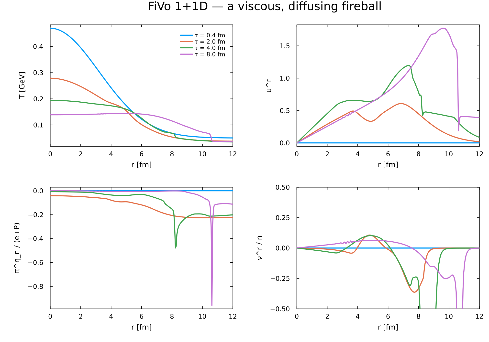
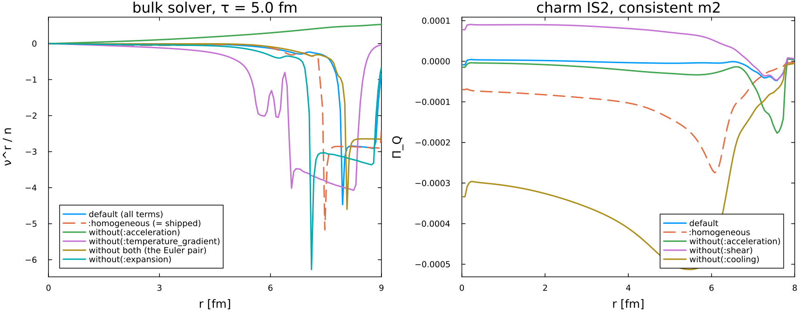
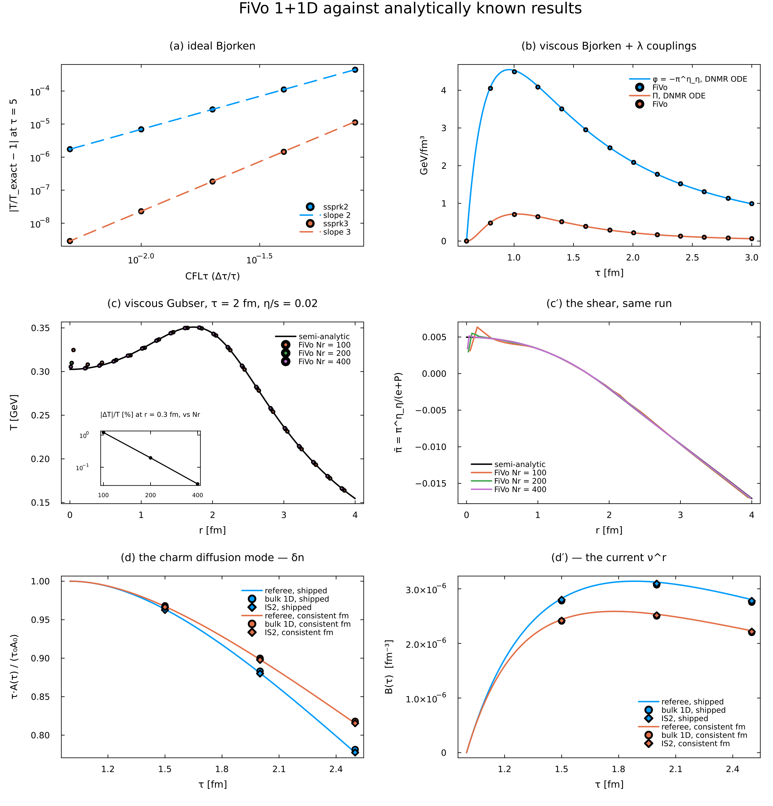

# FiVo 1+1D — examples

> ⚠ Paths beginning `Julia/Projects/…` or `Tex/…` name the **private research repository** this
> package is developed in. They are cited for provenance — so a number can be traced to the script
> that produced it — and are not links you can follow from a clone of this package.


Runnable, each with a figure in `figures/`. From the repository root:

```sh
julia -t auto --project=Julia/FiVoHydro.jl Julia/FiVoHydro.jl/examples1d/01_first_run.jl
```

| | what it shows | time |
|---|---|---|
| 01 first run | the library interface in one screen: `build_model_1d`, `show_equations`, `run_sim_1d!`, `fields_1d`, on a viscous, diffusing fireball with the consistent first moment | 15 s |
| 02 switching terms off | the `terms` interface in both 1+1D solvers. A fireball in the bulk solver with its first-moment terms removed by ingredient: `:homogeneous` ≡ shipped bit for bit, and the ∇T and inertial terms cancel as a pair. Then its T(τ, r), u^r(τ, r) as the frozen background of the charm IS2 solver, with the second moment's terms switched the same way | 35 s |
| 03 analytic benchmarks | the solvers against known results, as pictures: ideal Bjorken (orders 2 and 3), viscous Bjorken with shear, bulk and the λ couplings vs the DNMR ODEs, viscous Gubser vs its semi-analytic solution at three resolutions, and the charm diffusion mode through the bulk and IS2 solvers vs its closed ODE | 67 s |

⚠ **Running these from a standalone clone**: the commands above are written as they are run inside the
research repository this package is developed in. From a clone of `FiVoHydro.jl` alone, drop the
prefix — `julia -t auto --project=. examples1d/01_first_run.jl`. Nothing else changes.

⚠ **`Plots` is not a dependency of this package.** These examples `using Printf, Plots`, and
`Plots` is in neither `Project.toml` nor `Manifest.toml` — so `--project=Julia/FiVoHydro.jl`
finds it only through the shared default environment, and a fresh clone will fail at the
`using`. Install it into your default environment (`julia -e 'using Pkg; Pkg.add("Plots")'`)
or add it to this package's `Project.toml` before running them. Nothing in `src/`, `src2d/` or
`test/` needs it, which is why CI never noticed. (Recorded 2026-09-14.)

Times are the suite baseline (`Julia/Projects/suite_baseline.toml`), recorded 2026-09-14 — these three
entries had **no** baseline until then, because nothing had ever run them through `run_suite.jl`.

### 01 — the first run

The library interface in one screen, on a viscous, diffusing fireball with the consistent first
moment.



### 02 — switching terms off

The `terms` interface in both 1+1D solvers. `:homogeneous` reproduces the shipped row **bit for
bit**, and the ∇T and inertial terms cancel *as a pair* — each alone moves ν by an order of
magnitude, both together by 0.6×. Dropping one is a far bigger change than dropping both.



### 03 — analytic benchmarks

The solvers against known results, as pictures: ideal Bjorken at orders 2 and 3, viscous Bjorken
against the DNMR ODEs, viscous Gubser against its semi-analytic solution at three resolutions, and
the charm diffusion mode through both 1-D solvers against its closed ODE.



The same checks, asserted rather than plotted, are the 1+1D validation ladder `test/run1d_gates.jl`
(`README.md` §5). The 2+1D examples are in [`../examples2d/`](../examples2d/README.md). `run_suite.jl` discovers this
directory by its prefix and runs everything here.
