# FiVoHydro 2+1D — worked examples

Eleven runnable setups for `main2D.jl` / `src2d/`, each seconds to a few minutes, each producing a figure in
`figures/`. They are written to be **copied and edited**, and every trap this solver has actually
shipped is called out in a comment where it would bite.

```sh
julia -t auto --project=Julia/FiVoHydro.jl Julia/FiVoHydro.jl/examples2d/01_first_run.jl
julia -t auto --project=Julia/FiVoHydro.jl Julia/FiVoHydro.jl/examples2d/02_elliptic_flow.jl
julia -t auto --project=Julia/FiVoHydro.jl Julia/FiVoHydro.jl/examples2d/03_choosing_a_resolution.jl
julia -t auto --project=Julia/FiVoHydro.jl Julia/FiVoHydro.jl/examples2d/04_fluctuating_event.jl
julia -t auto --project=Julia/FiVoHydro.jl Julia/FiVoHydro.jl/examples2d/05_dissipative_sectors.jl
julia -t auto --project=Julia/FiVoHydro.jl Julia/FiVoHydro.jl/examples2d/06_charm_terms.jl
julia -t auto --project=Julia/FiVoHydro.jl Julia/FiVoHydro.jl/examples2d/07_real_event.jl
julia -t auto --project=Julia/FiVoHydro.jl Julia/FiVoHydro.jl/examples2d/08_vorticity.jl
julia -t auto --project=Julia/FiVoHydro.jl Julia/FiVoHydro.jl/examples2d/09_gubser.jl
julia -t auto --project=Julia/FiVoHydro.jl Julia/FiVoHydro.jl/examples2d/10_showcase.jl
julia -t auto --project=Julia/FiVoHydro.jl Julia/FiVoHydro.jl/examples2d/11_swirl_showcase.jl
```

⚠ **Running these from a standalone clone**: the commands above are written as they are run inside the
research repository this package is developed in. From a clone of `FiVoHydro.jl` alone, drop the
prefix — `julia -t auto --project=. examples2d/01_first_run.jl`. Nothing else changes.

⚠ **`Plots` is not a dependency of this package.** These examples `using Printf, Plots`, and
`Plots` is in neither `Project.toml` nor `Manifest.toml` — so `--project=Julia/FiVoHydro.jl`
finds it only through the shared default environment, and a fresh clone will fail at the
`using`. Install it into your default environment (`julia -e 'using Pkg; Pkg.add("Plots")'`)
or add it to this package's `Project.toml` before running them. Nothing in `src/`, `src2d/` or
`test/` needs it, which is why CI never noticed. (Recorded 2026-09-14.)

| | what it shows |
|---|---|
| **01** the first run | the whole API — grid, model, state, IC, driver, readout — on a transversely uniform state, which must integrate the 0+1D DNMR equations; and why the agreement is 1e-3 rather than 1e-13 |
| **02** elliptic flow | ε₂ → momentum anisotropy, the reason to run 2+1D at all, with the sector ladder run from one initial condition and the ε₂ = 0 control |
| **03** choosing a resolution | the three-grid Richardson study, and why a field, an observable and a conserved quantity converge at three different rates |
| **04** a fluctuating event | v₃ from lumps, why it needs one event at a time, and harmonics about the participant plane rather than the grid axes |
| **05** the dissipative sectors | what each sector changes and costs, how big \|π\|/P really gets, and whether the regulators are inert |
| **06** the charm terms | `show_equations`, the `Terms2D` switches, and what each term of the consistent first and second moments moves when removed — including the vorticity coupling that is off by default |
| **07** a real event | a single un-averaged MC-Glauber Pb+Pb event from file to freeze-out, raw against lightly smoothed (`smooth_fm`); what the blur costs in ε₂, ε₃ and the response, and a mask artefact that doubles ε_p if you let it |
| **08** vorticity on vs off | `m2_vorticity` measured rather than assumed: \|ω\|/\|σ\| over the fireball, what the term moves in π_Q and Π_Q, and the proof that it moves neither the medium nor the current |
| **09** Gubser flow | the one 2-D problem with an exact answer: solver beside the closed form, and the convergence order that turns "looks right" into a number |
| **10** the showcase | the same solver with nothing switched off — a real Pb+Pb event, `m2_vorticity = true`, run long and fine, drawn for the eye rather than for a table. It measures nothing new; read it for how to render a run, and for why `n·τ` and `n·(r+r₀)·τ` are the panels that keep their structure |
| **11** the swirl showcase | a deliberately extreme event — 50 hot spots and a rigid-body swirl — with every transport sector on, run to τ = 12 fm/c. ⚠ a PICTURE, not a measurement: the IC is synthetic and tuned for drama. Read it for what vorticity does to a lumpy medium, and for the \|ω\|/\|σ\| row, which starts near-black (rigid rotation is shear-free) and builds vortex sheets that grow while the swirl itself decays |

## The figures

### 01 the first run · 02 elliptic flow · 03 choosing a resolution

The whole API on a transversely uniform state, which must integrate the 0+1D DNMR equations; then
ε₂ → momentum anisotropy, the reason to run 2+1D at all, with the ε₂ = 0 control that must return
identically zero; then the three-grid Richardson study, and why a field, an observable and a
conserved quantity converge at three different rates.

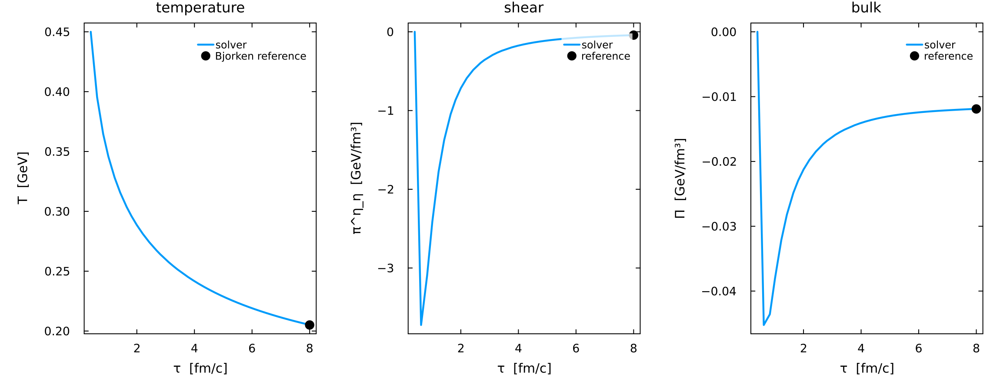
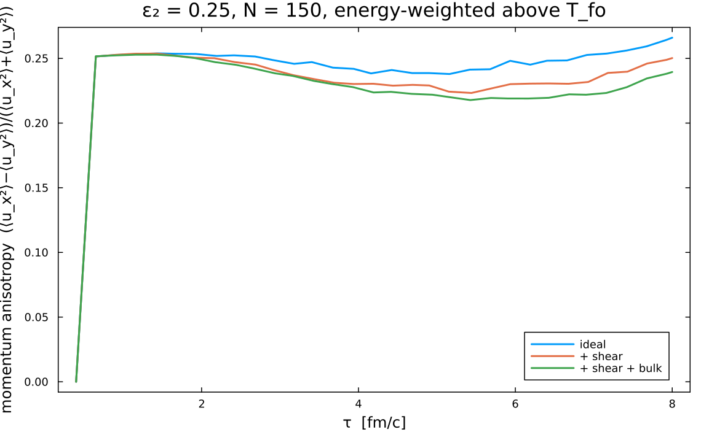
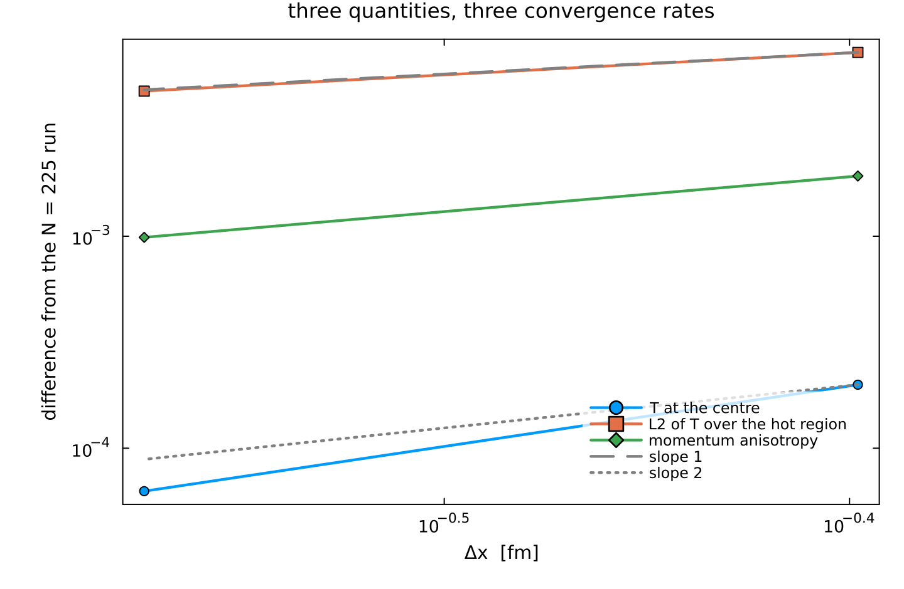

### 04 a fluctuating event · 05 the dissipative sectors · 06 the charm terms

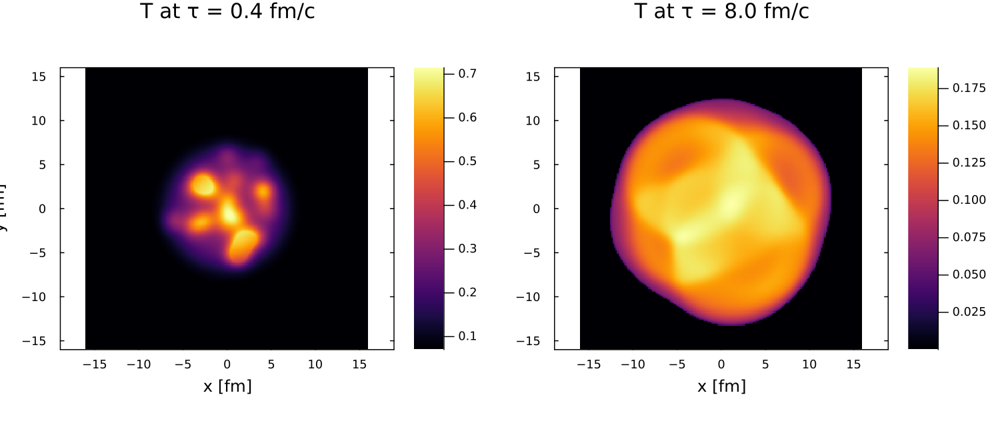
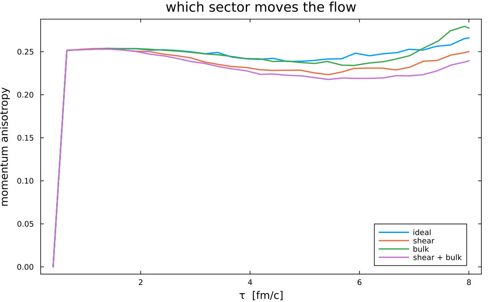
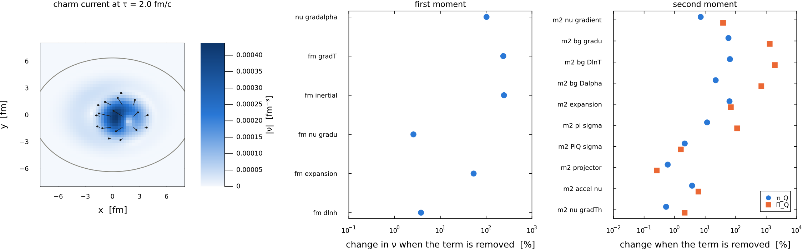

### 07 a real event · 08 vorticity · 09 Gubser

One un-averaged MC-Glauber Pb+Pb event to freeze-out, raw against lightly smoothed; `m2_vorticity`
measured rather than assumed; and the one 2-D problem with an exact answer.

⚠ The vorticity figure shown is the **N = 640** render (`EX08_N=640`, ~12 min), not the N = 160 the
default run produces — the filaments are the point and they need the grid. The default writes
`ex08_vorticity.png` beside it, and the conclusion is the same: the median |ω|/|σ| moves 3.01e-2 →
2.79e-2 from N = 160 to 640, i.e. it **converges**. Same for the showcase below, committed at
N = 400 against a default of 240.

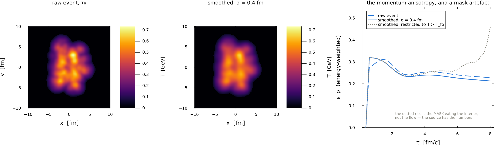
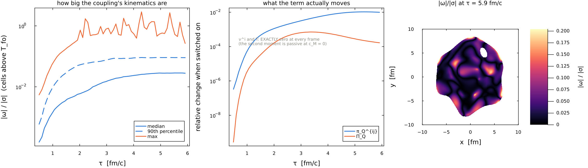
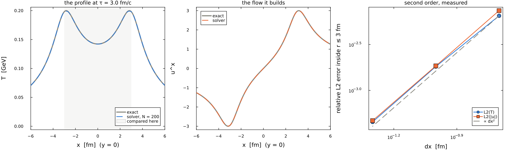

### 10 the showcase

Same solver, nothing switched off, run long and fine, drawn for a slide rather than for a table.
⚠ read the charm-stress panel, not the fireball ones: at `c_M = 0` the second moment is passive, so
`m2_vorticity = true` moves π_Q and **nothing else** — T, u^i and ν^i are bit-identical.

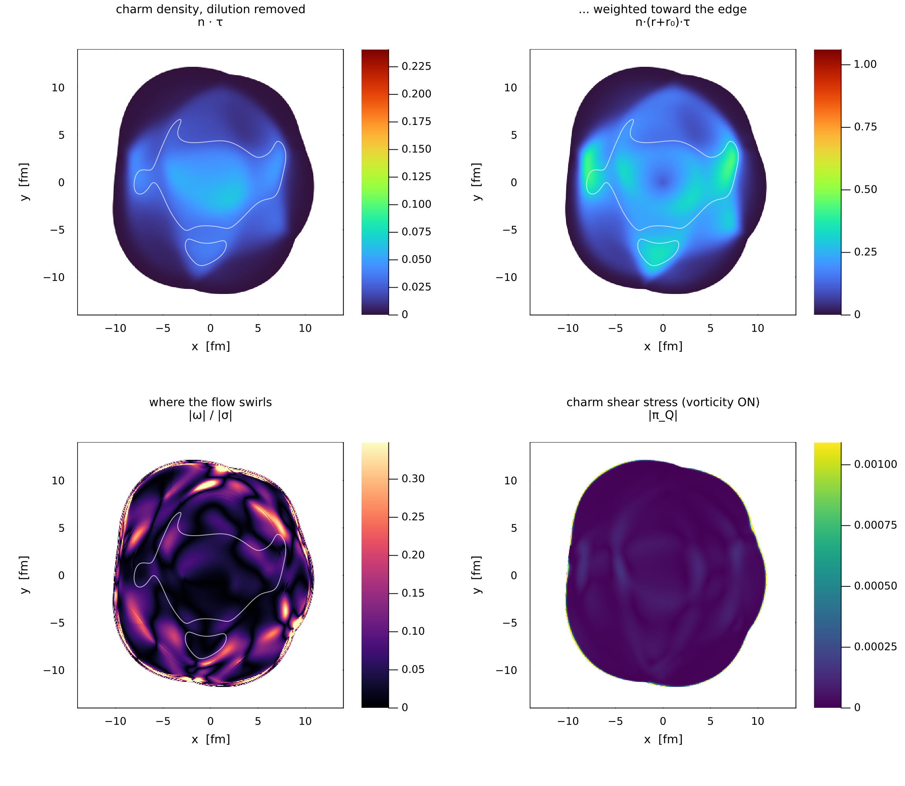

### 11 the swirl showcase

Fifty hot spots on the production profile, spun with a rigid-body swirl, every sector on, run to
τ = 12 fm/c at N = 560. Four fields × four times: **T**, the charm density with the Bjorken dilution
divided out, **|ω|/|σ|**, and the charm shear stress.
⚠ The swirl is an INITIAL CONDITION, not a conserved spin — Milne with boost invariance carries no
transverse angular-momentum law, so it decays. What survives is the vorticity it seeded: the
|ω|/|σ| row starts near-black (rigid rotation is shear-free) and builds bright vortex sheets that
are strongest at the *last* frame.
⚠ At `c_M = 0` the charm second moment is passive, so `m2_vorticity = true` moves the |π_Q| row and
**nothing else**.

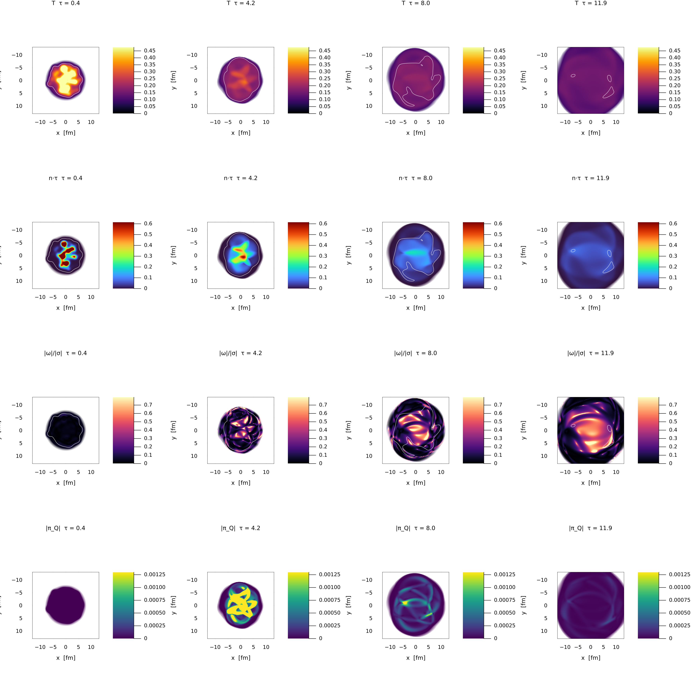

**Four of them write ANIMATIONS** into `figures/anim/` (gifs, a few MB each, **not tracked by
git** — regenerable, and this package untracked 6.9 MB of figures once already):

| file | what moves |
|---|---|
| `ex07_temperature.gif`, `ex07_charm_density.gif` | the event cooling to freeze-out, with the T_fo contour; the charm density diluting |
| `ex08_omega_over_sigma.gif`, `ex08_delta_piQxx.gif` | where the transverse vorticity lives, and where switching the coupling on changes π_Q |
| `ex09_gubser.gif` | solver, exact solution and their difference, side by side in time |
| `ex10_charm_ntau.gif`, `ex10_charm_nrtau.gif`, `ex10_omega_sigma.gif`, `ex10_charm_stress.gif` | the showcase panels on one real event to τ = 8 fm/c: `n·τ`, `n·(r+r₀)·τ`, \|ω\|/\|σ\|, and the charm stress the vorticity coupling actually moves |

**High resolution.** Example 08 takes `EX08_N` (default 160): `EX08_N=480 EX08_NFRAME=60
EX08_SIZE=900 EX08_FPS=12 julia …` renders the vorticity study at 3x (~5 min; N = 640 is 4x and
~12 min). Fine runs write `*_N<N>.gif` / `ex08_vorticity_N<N>.png`, so they never overwrite the
default ones. The conclusion **converges**, which is the point of running it fine at all:

| N | dx [fm] | \|ω\|/\|σ\| median | p90 | π_Q shift | Π_Q shift |
|---|---|---|---|---|---|
| 160 | 0.175 | 3.01e-2 | 1.02e-1 | 1.24e-2 | 2.26e-4 |
| 480 | 0.058 | 2.84e-2 | 9.15e-2 | 1.00e-2 | 1.66e-4 |
| 640 | 0.044 | 2.79e-2 | 9.04e-2 | 9.91e-3 | 1.67e-4 |

160 → 480 moves the median 6 % and the π_Q shift 19 %; 480 → 640 moves them 1.8 % and 1.0 %. The
`max` column is the exception and does **not** converge — it grows with resolution, because the
sharpest filaments are exactly what refinement resolves. Read the median and the p90.

**Example 10's tracked figure is the N = 400 render**, not the default one: `figures/ex10_showcase_N400.png`
was made with `EX10_N=400` (the filename carries `N`, so renders never overwrite each other). Running it at its committed default `EX10_N=240` — which is what the suite
does — writes `ex10_showcase_N240.png` beside it and leaves the tracked one alone.

**Seeing the whole tail.** The 08 maps frame the fireball and fade past freeze-out, because that is
where the quoted numbers live. `EX08_NOFADE=1` shows every cell holding fluid at full strength on
the whole ±14 fm box, and `EX08_TAUF=8.0` runs past the default 6 fm/c — both change the filename,
neither changes a number (every statistic is over `T > T_fo` cells regardless). That render is what
turned up the **outer vorticity**: at r ≈ 9–12 fm, \|ω\| runs ~350× the all-cell median while \|σ\|
is merely 2× it, so the fluid's outer edge swirls far harder than the fireball it came from.
⚠ a nofade gif and a faded one carry different colorbars by construction — each is scaled (p99.5) to
the cells it draws, so brightness is not comparable between them.

⚠ Three rules those animations follow. Two were learned the hard way in
`Projects/FiVoFluidumComparison/animate_fluctuating_fields.jl`: the colour scale is **fixed across
frames** (a per-frame scale makes a cooling fireball look static), and it is taken from cells
**above freeze-out** (the vacuum tail carries \|u\| several times the fireball's, and one such cell
flattens every frame to a single colour). The third is **no hard mask edge**: a
`T > T_fo ? value : NaN` mask draws the fireball with a razor rim that moves frame to frame and
reads as a rendering artefact rather than as a freeze-out surface. Example 08 fades the colour into
the background over a temperature band and keeps the T_fo **contour** on top; example 09 fades its
error across the comparison radius and draws that radius as a **ring**. Both fade the colour only —
08 deliberately does not damp the value, because the bright fringe just inside freeze-out is real
(σ there is *above* the hot-cell median; `EX08_DIAG=1` prints the check).

These are **examples, not gates**. The validation ladder is `test/run2d_gates.jl` (22 gates; the
table and the last run are in `../README2D.md` §5), the equations are `../EQUATIONS2D.md`, and the
physics behind each gate is `TWOD_PROGRAM.md`. Run the ladder before trusting a change; run these to
learn the API or to start a new study. (This paragraph said "18 gates, all passing as of 2026-09-03"
until 2026-09-10.)

```sh
julia -t auto --project=Julia/FiVoHydro.jl Julia/FiVoHydro.jl/test/run2d_gates.jl
```

## The four things that bite hardest here

1. **`finalize_ic!` is not optional on a hand-built IC.** `set_cell!` writes primitives into
   conserved variables cell by cell and applies no floors; a profile with a vacuum tail starts below
   the energy floor in its outer cells and the run dies within a few steps.
   `initialize_uniform!` and `initialize_from_radial!` call it for you — nothing else does.

2. **Julia soft scope kills accumulators, and it killed one of these examples while it was being
   written.** `prev = e` inside a *top-level* `for` creates a new local every iteration. In an
   example you get an `UndefVarError`; in a PASS/FAIL gate you get a silent PASS. Put the loop in a
   function. (`CLAUDE.md`, trap #1.)

3. **The repo's own initial conditions carry no ε₂ and no ε₃.** `data/initial_profiles_physical.csv`
   is `r, T, α` on 1002 radial points because the IC builder φ-averages every binary collision
   *upstream* of FiVo (`TWOD_PROGRAM.md` §0). Running them in 2+1D is a validation exercise — the
   2-D answer must reproduce the 1-D one — and yields zero elliptic flow. Examples 02 and 04 build
   their own deformed and lumpy initial conditions for that reason.

4. **The scheme is second order in the ideal sector and first order once anything dissipative is
   on.** Advection is SSPRK2 (gate G0 measures exactly 2.00); the dissipative sectors are relaxed by
   an operator split once per accepted step. Example 01 measures the crossover: halving `CFLτ`
   halves the error, not quarters it.

## And two that are specific to reading the numbers

**Measure the response, not the observable.** ε₂ → anisotropy is a transfer function. Quoting the
output alone hides whether a change moved the medium or moved the initial condition, so every
comparison here divides by the input and runs the ε₂ = 0 control that must return identically zero.

**A statistic can improve because its denominator grew.** Refining the grid changes the number of
cells in every average; report the quantity and its scale together. The same failure mode cost this
programme a headline number once already (`CLAUDE.md`).
